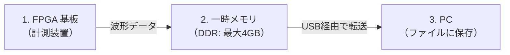
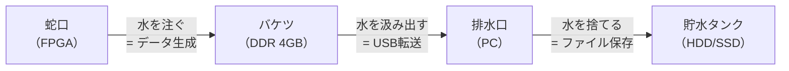
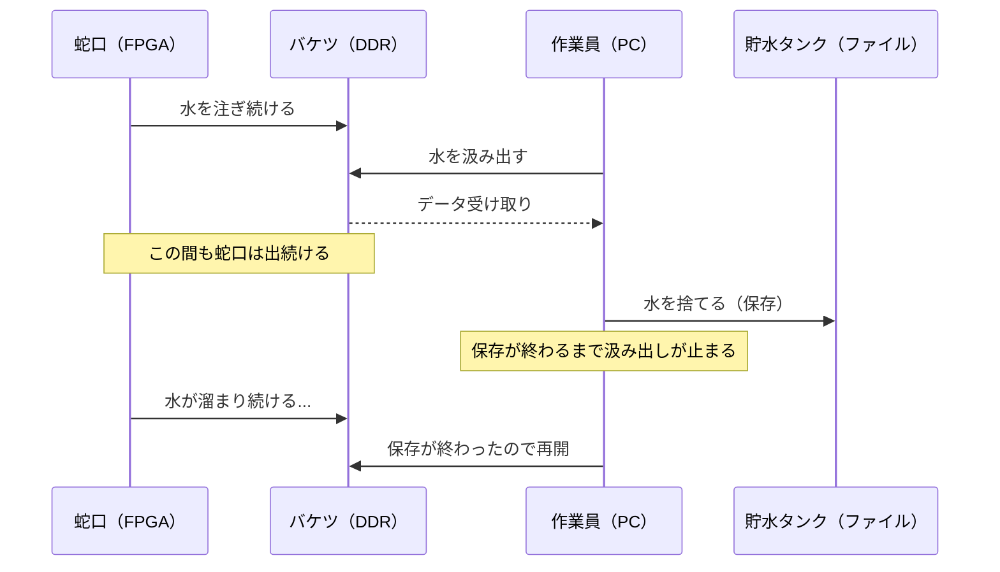
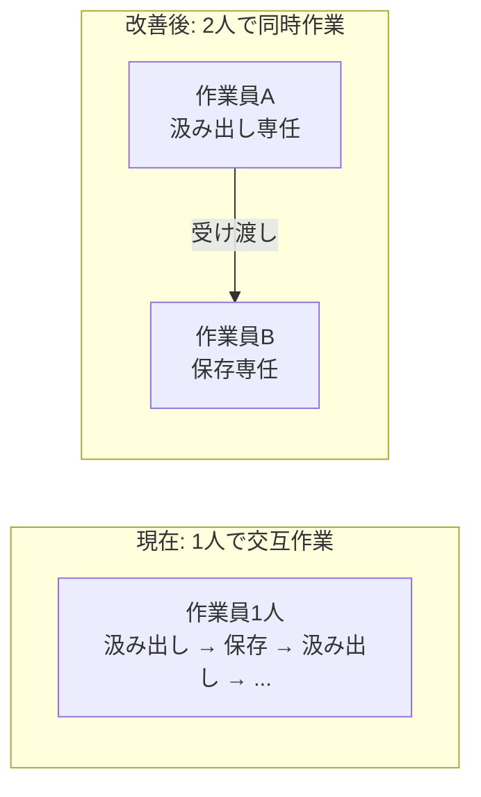

# データ保存中に計測データの読み出しが止まる問題について

## 要約

現在のソフトウェアでは、FPGA 基板から受け取った計測データを PC のファイルに保存している最中、次のデータの受け取りが完全に停止します。保存先のストレージ（HDD やネットワークドライブなど）が遅い場合やSSDに他の書き込み等が発生した場合に、FPGA 基板上の一時メモリ（DDR）がデータで溢れ、**計測データが失われる可能性**があります。現状この問題に対する保護策はありません。

---

## データの流れ

計測データは以下の 3 ステップで処理されます。

| ステップ          | 役割                               | 速度            |
| ------------- | -------------------------------- | ------------- |
| 1. FPGA 基板    | トリガ（細胞通過など）を検出し、波形データを生成する       | 非常に高速・連続的     |
| 2. 一時メモリ（DDR） | FPGA が生成したデータを一時的に蓄えるバッファ。最大 4GB | 高速だが容量に上限がある  |
| 3. PC         | DDR からデータを USB で受け取り、ファイルに保存する   | **保存先の速度に依存** |

---

## 問題の仕組み

### 水道とバケツで例えると

この問題は「水道とバケツ」に例えると分かりやすくなります。

- **蛇口（FPGA）** は常に一定の速さで水を出し続けます（= 計測データを生成し続けます）
- **バケツ（DDR）** は 4GB の容量があります
- **排水口（PC）** がバケツから水を汲み出し、貯水タンク（ファイル）に捨てます

### 現在の動作: 「汲み出し」と「捨てる」が交互にしかできない

現在のソフトウェアでは、**バケツから水を汲み出す作業**と**貯水タンクに水を捨てる作業**を 1 人で交互に行っています。

**貯水タンクに水を捨てている間は、バケツから汲み出す手が空いていない**ため、その間もバケツには蛇口から水が注がれ続けます。

---

## 影響: ストレージが遅いとデータが失われる

保存先のストレージが遅いほど「水を捨てる時間」が長くなり、バケツが溢れやすくなります。

| 保存先                    | 書き込み速度の目安        | リスク             |
| ---------------------- | ---------------- | --------------- |
| NVMe SSD（PC内蔵の高速ストレージ） | 2,000〜5,000 MB/秒 | 低い              |
| SATA SSD（一般的な内蔵ストレージ）  | 400〜550 MB/秒     | 低い              |
| USB 外付け HDD            | 80〜150 MB/秒      | **注意が必要**       |
| ネットワークドライブ             | 10〜100 MB/秒（不安定） | **データロスの恐れあり**  |
| USB メモリ                | 5〜40 MB/秒        | **データロスの恐れが高い** |

特にネットワークドライブや USB メモリは書き込み速度が不安定で、突然遅くなることがあります。そのような環境では、一時的な速度低下でバケツ（DDR）が溢れ、計測データが失われる可能性があります。

---

## 現状の保護策

**現在、この問題に対する保護策はありません。**

- DDR が溢れそうかどうかを事前に警告する仕組みがない
- 保存先ストレージの速度を事前にチェックする仕組みがない
- 問題が発生してもログに記録されるだけで、データ復旧はできない

---

## 改善方針

[USB データ取得・書き込み安定性改善プラン](../../operations/usb-acquisition-stability/2026-03-02-usb-acquisition-stability.md) の Phase 2 で、「作業員を 2 人にする」改善を計画しています。

- **作業員 A（USB 読み出しスレッド）**: バケツから水を汲み出すことに専念
- **作業員 B（ファイル書き込みスレッド）**: 受け取った水を貯水タンクに捨てることに専念

これにより、ファイル保存中もデータの受け取りが継続され、DDR が溢れるリスクを大幅に低減できます。

---

## 関連資料

- [USB データ取得・書き込み安定性改善プラン](../../operations/usb-acquisition-stability/2026-03-02-usb-acquisition-stability.md)
