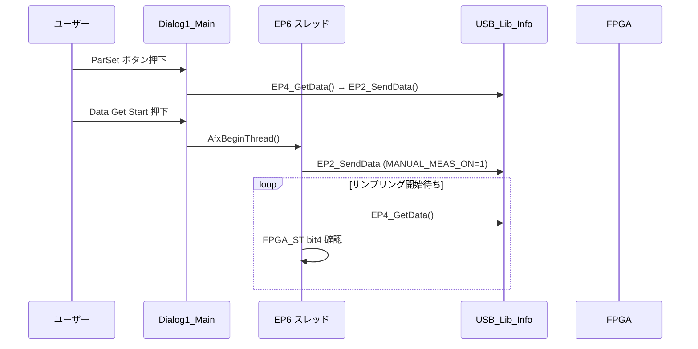
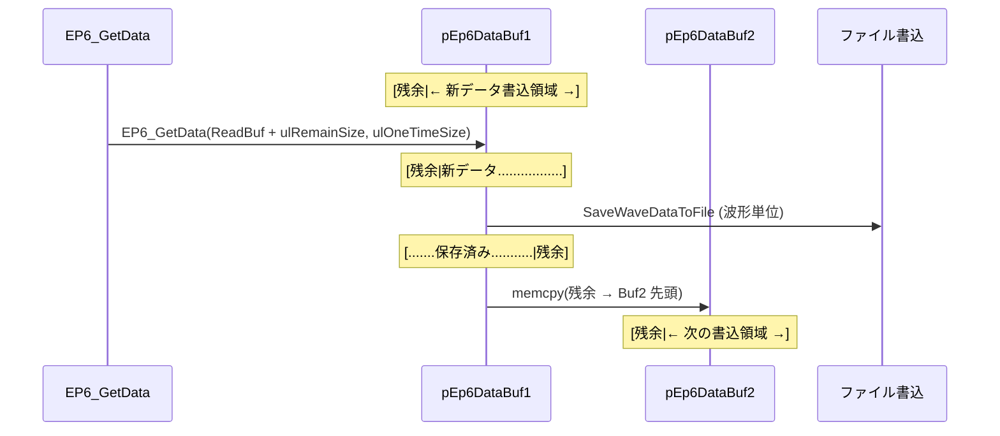
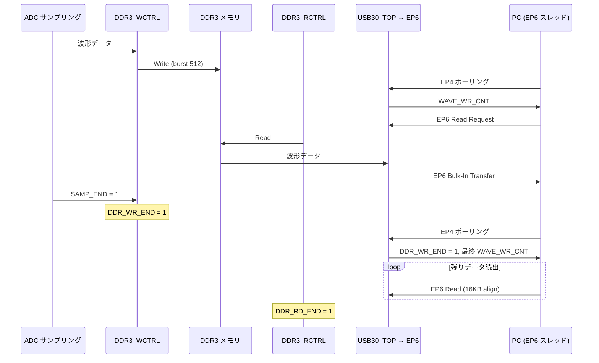
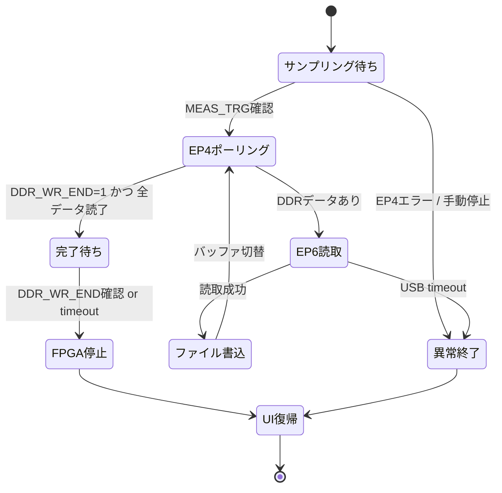
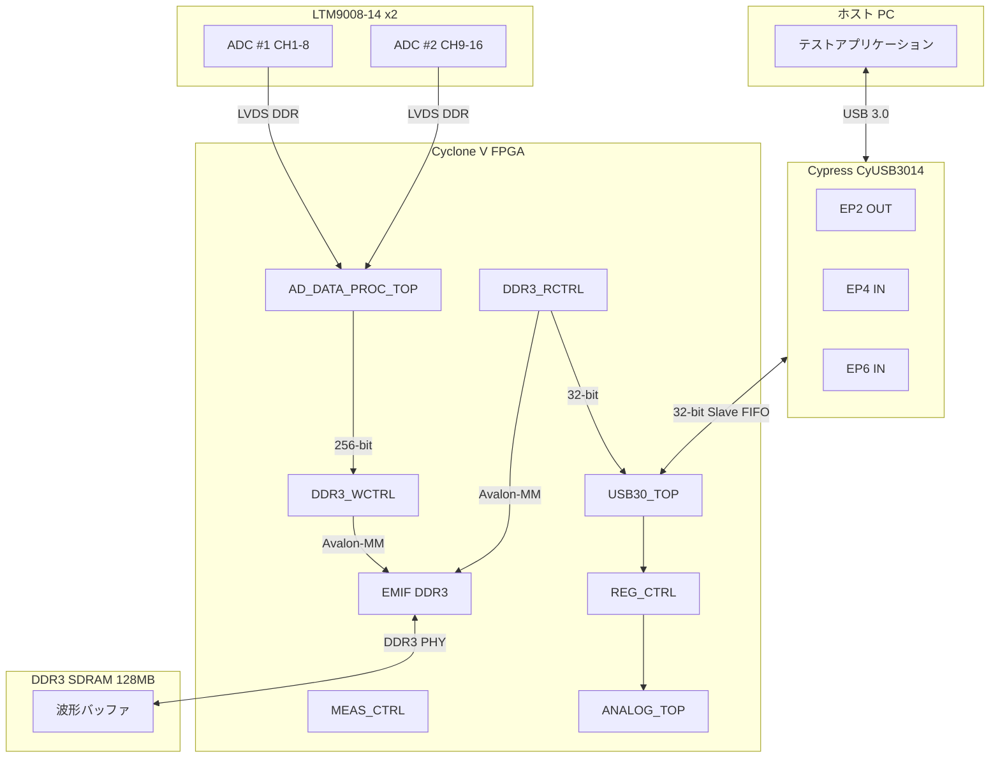
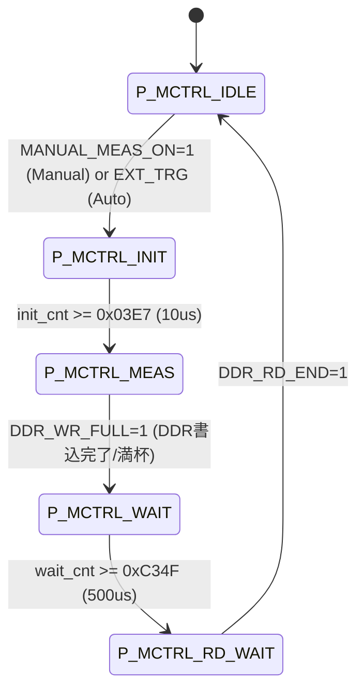
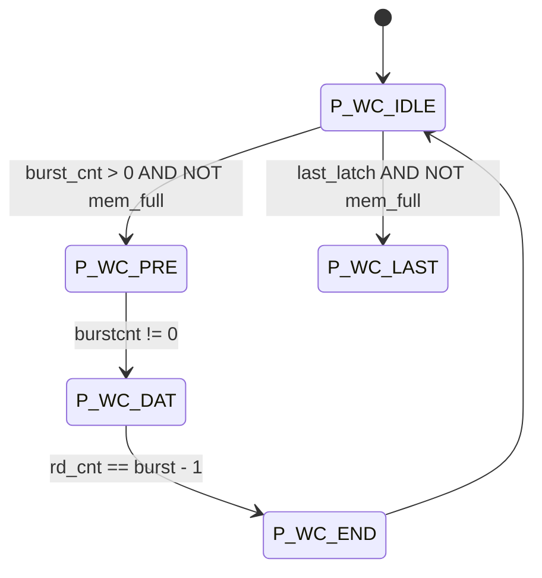
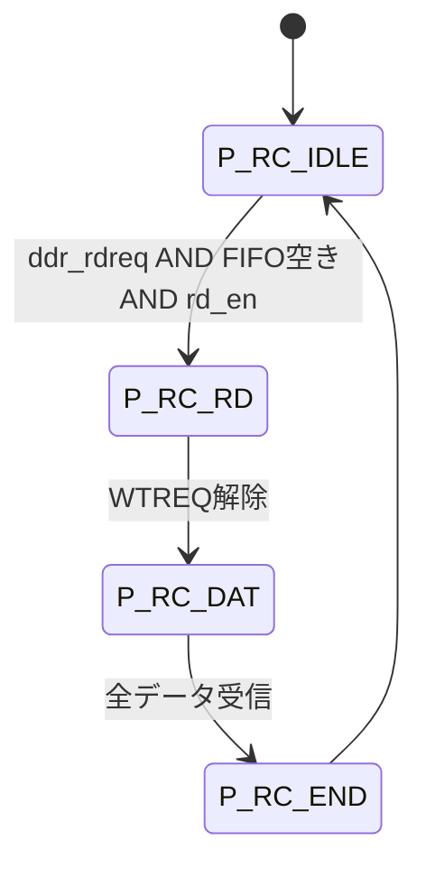

# Sysmex AnalogBoard TestApp アプリケーション仕様書

> 対象: Initial commit (aebf296) 時点のコード
> 目的: Rust等で再実装できる粒度でアプリ仕様を文書化
> 作成日: 2026-03-21
> 改訂日: 2026-03-21 (構成再編: source-backed / derived / migration guidance を分離)

---

## 目次

0. [この文書の読み方](#0-この文書の読み方)
1. [UI・ダイアログ仕様](#1-uiダイアログ仕様)
2. [USB接続フロー](#2-usb接続フロー)
3. [FPGA レジスタ設定仕様](#3-fpga-レジスタ設定仕様)
4. [波形取得フロー](#4-波形取得フロー)
5. [データ仕様](#5-データ仕様)
6. [DLL API 仕様](#6-dll-api-仕様)
7. [派生知見: FPGA/RTL・下流連携メモ](#7-派生知見-fpgartl下流連携メモ)
8. [テスト方針](#8-テスト方針)
9. [セキュリティ方針](#9-セキュリティ方針)
10. [依存関係](#10-依存関係)
11. [後方互換性・移行方針](#11-後方互換性移行方針)
12. [実装計画](#12-実装計画)
13. [未確定事項](#13-未確定事項)

---

## 0. この文書の読み方

### 0.1 目的と適用範囲

この文書は、**Initial commit (`aebf296`) の TestApp/DLL 実装を再現するための仕様**を主目的とする。  
レビューで判明したとおり、従来版は Initial commit の事実と後続調査の知見が混在していたため、本改訂では provenance を分離した。

### 0.2 provenance ラベル

本書では各節の性質を以下の 3 区分で読む。

- **source-backed**: `aebf296` のアプリ/DLLコード、リソース、同梱ファイルから直接確認できる事実
- **derived**: RTL、下流 `sys_app`、後続ブランチの調査結果から得た補足知見
- **migration guidance**: 再実装時の推奨。Initial commit の忠実再現仕様ではない

### 0.3 In Scope

- MFC TestApp の UI、入力値、状態遷移
- DLL API の契約
- Initial commit が実際に生成・消費する CSV / `.bin` / `_cfg.txt`
- ホストアプリが直接使用する FPGA レジスタとその変換ロジック

### 0.4 Out of Scope

- Win11 向け hardening 実装の採用判断
- `sys_app` 側の将来改修内容の確定
- RTL の全実装を source of truth とした完全仕様化
- Rust 実装で採用する USB ライブラリや driver の最終決定

### 0.5 読み進め方

- 1〜6章は **Initial commit 再現のための主仕様** として読む
- 7章は **derived** な補足であり、初期実装だけからは確定しない情報を含む
- 8〜13章は **再実装プロジェクトを進めるための補助章** であり、Initial commit の事実仕様そのものではない

---

## 1. UI・ダイアログ仕様

### 1.1 アプリケーション構成

#### ウィンドウ階層

```
CSysmexAnalogBoardTestAppApp (アプリケーションクラス)
  └── CSysmexAnalogBoardTestAppDlg (メインダイアログ: IDD_SYSMEX_ANALOGBOARD_TESTAPP_DIALOG)
        ├── TabControl (IDC_TAB_MAIN)
        │     ├── [タブ0] Dialog1_Main (IDD_DIALOG1_MAIN) - "Data Get" タブ
        │     └── [タブ1] Dialog2_Debug (IDD_DIALOG2_DEBUG) - "FPGA Debug" タブ ※初期コミット時点ではコメントアウトにより無効
        ├── GroupBox "Log"
        └── ListBox (IDC_LIST1) - ログ表示領域
```

#### 起動シーケンス

1. `CSysmexAnalogBoardTestAppApp::InitInstance()` が `CSysmexAnalogBoardTestAppDlg` をモーダルダイアログとして生成・表示 (`DoModal`)
2. `CSysmexAnalogBoardTestAppDlg::OnInitDialog()` にて以下を実行:
   - システムメニューに "About..." を追加
   - タブコントロールに "Data Get" タブを追加（"FPGA Debug" タブはコメントアウト）
   - `Dialog1_Main` を子ダイアログとしてタブコントロール内に生成
   - タブの表示領域を計算し、選択中タブに対応するダイアログを表示
   - `USB_Lib_Info::USBBoard_Connect()` によりUSBボード接続を試行し、結果をログに出力（USB3.0/USB2.0/失敗）
3. `Dialog1_Main::OnInitDialog()` にて以下を実行:
   - 全チャンネルのゲインコンボボックスを選択肢で初期化
   - トリガチャンネルコンボボックスを "Ch1"〜"Ch13" で初期化
   - FIRフィルタFCコンボボックスを2項目で初期化
   - マニュアルモードラジオボタンを選択状態にセット
   - 収集波形カウントを "0"・読み取り専用に設定
   - DLLバージョンを取得しログに出力
   - `default_config.csv` から設定値を自動インポート
   - 全チャンネルのトータルゲイン表示を更新
   - EP2/EP4用のUSBバッファを確保

#### 終了シーケンス

- ウィンドウクローズ時に `ExportDefaultConfigFile()` が呼ばれ、現在の設定が `default_config.csv` に自動保存される

#### キー入力制御

- Enter キーおよび Escape キーは全ダイアログで無視される（ダイアログの意図しないクローズ防止）

#### USB Plug & Play 対応

- `WM_DEVICECHANGE` メッセージを監視
- デバイス接続時 (`DBT_DEVICEARRIVAL`): 未接続なら自動接続試行
- デバイス取り外し時 (`DBT_DEVICEREMOVECOMPLETE`): 切断処理後に再接続試行

---

### 1.2 Dialog1_Main（メイン設定画面 / "Data Get" タブ）

#### 1.2.1 設定データ構造体 (FPGAConfigI_REGMAP)

UI上の全設定値は以下の構造体にまとめられる。この構造体がFPGAレジスタへの書き込みデータの元となる。

| フィールド | 型 | 説明 |
|---|---|---|
| `GainCh[13][5]` | double | CH1〜CH13 の Gain1〜Gain5（5段のゲイン倍率） |
| `OffsetValue[13]` | float | CH1〜CH13 のオフセット値 (mV) |
| `ExtCtrlVol1[5]` | unsigned short | CH9〜CH13 の外部制御電圧1 (mV) |
| `ExtCtrlVol2[6]` | unsigned short | CH3〜CH8 の外部制御電圧2 (mV) |
| `FirFilterFC` | unsigned char | FIRフィルタFC選択 (0 or 1) |
| `CHSelect[13]` | unsigned char | CH1〜CH13 の選択状態 (0/1) |
| `TriggerCh` | unsigned char | トリガチャンネル (1〜13) |
| `TriggerValue` | unsigned short | トリガ値 (mV) |
| `TriggerRange[2]` | float | トリガレンジ [0]=マイナス側, [1]=プラス側 (us) |
| `ManualMode` | unsigned char | マニュアル取得モード (0=Auto, 1=Manual) |
| `WaveNum` | unsigned short | 1ファイルあたりの波形数 |
| `SavePath` | string | 保存先パス |

#### 1.2.2 全コントロール一覧

##### ゲイン設定セクション

**低周波ゲイン (CH1〜CH8)**

各チャンネルに Gain1〜Gain5 の5段構成。CH1〜CH8 は "Low frq Gain" グループ。

| コントロール | 型 | 用途 |
|---|---|---|
| `IDC_COMBO_CHn_GAIN_MULTIP_1` (n=1..8) | ドロップダウンリスト | Gain1 倍率選択（2値: 各CHごとに定義済み） |
| `IDC_COMBO_CHn_GAIN_MULTIP_2` (n=1..8) | ドロップダウンリスト | Gain2 倍率選択（2値） |
| `IDC_EDIT_CHn_GAIN_MULTIP_3` (n=1..8) | テキスト入力 (CColorEdit) | Gain3 倍率の自由入力（範囲: -1.0 〜 -0.5） |
| `IDC_COMBO_CHn_GAIN_MULTIP_4` (n=1..8) | ドロップダウンリスト | Gain4 倍率選択（2値） |
| `IDC_COMBO_CHn_GAIN_MULTIP_5` (n=1..8) | ドロップダウンリスト | Gain5 倍率選択（2値、初期状態で無効） |

CH1〜CH8のゲイン倍率テーブル（全CH共通）:

| 段 | 選択肢1 | 選択肢2 |
|---|---|---|
| Gain1 | -0.20 | -0.40 |
| Gain2 | -1.00 | -4.00 |
| Gain3 | -1.0 〜 -0.5 (自由入力) | -- |
| Gain4 | 2.00 | 4.00 |
| Gain5 | -1.35 | -1.35 (固定) |

**高周波ゲイン (CH9〜CH13)**

| コントロール | 型 | 用途 |
|---|---|---|
| `IDC_COMBO_CHn_GAIN_MULTIP_1` (n=9..13) | ドロップダウンリスト | Gain1 倍率選択 |
| `IDC_COMBO_CHn_GAIN_MULTIP_2` (n=9..13) | ドロップダウンリスト | Gain2 倍率選択 |
| `IDC_COMBO_CHn_GAIN_MULTIP_3` (n=9..13) | ドロップダウンリスト | Gain3 倍率選択（初期状態で**無効**） |
| `IDC_COMBO_CHn_GAIN_MULTIP_4` (n=9..13) | ドロップダウンリスト | Gain4 倍率選択（初期状態で**無効**） |
| `IDC_COMBO_CHn_GAIN_MULTIP_5` (n=9..13) | ドロップダウンリスト | Gain5 倍率選択（初期状態で**無効**） |

CH9〜CH12のゲイン倍率テーブル（共通）:

| 段 | 選択肢1 | 選択肢2 |
|---|---|---|
| Gain1 | -0.50 | -2.00 |
| Gain2 | -1.00 | -2.00 |
| Gain3 | 1.00 | 1.00 (固定) |
| Gain4 | 1.00 | 1.00 (固定) |
| Gain5 | 1.00 | 1.00 (固定) |

CH13のゲイン倍率テーブル:

| 段 | 選択肢1 | 選択肢2 |
|---|---|---|
| Gain1 | -0.50 | -2.00 |
| Gain2 | -1.00 | -2.00 |
| Gain3 | -1.00 | -1.00 (固定) |
| Gain4 | 1.00 | 1.00 (固定) |
| Gain5 | 1.00 | 1.00 (固定) |

**トータルゲイン表示**

| コントロール | 型 | 用途 |
|---|---|---|
| `IDC_STATIC_GAIN_CH1` 〜 `IDC_STATIC_GAIN_CH13` | 静的テキスト | 各CHの全段ゲインの積を "X.XX倍" の形式で表示。Gain1〜5のいずれかが変更されるたびに即時再計算・表示更新 |

**トータルゲイン計算式:**
```
Total Gain = Gain1 * Gain2 * Gain3 * Gain4 * Gain5
```

##### オフセット値セクション

| コントロール | 型 | 用途 | 入力範囲 |
|---|---|---|---|
| `IDC_EDIT_OFFSET_1` 〜 `IDC_EDIT_OFFSET_13` | テキスト入力 (CColorEdit) | CH1〜CH13のオフセット値入力 | 1414 〜 1494 mV |

##### 外部制御電圧セクション

**Ext Ctrl Vol1 (高周波チャンネル用)**

| コントロール | 型 | 用途 | 入力範囲 |
|---|---|---|---|
| `IDC_EDIT_VOL1_9` 〜 `IDC_EDIT_VOL1_12` | テキスト入力 (CColorEdit) | CH9〜CH12 の外部制御電圧1 | 0 〜 1100 mV |
| `IDC_EDIT_VOL1_13` | テキスト入力 (CColorEdit) | CH13 の外部制御電圧1 | 0 〜 5000 mV |

**Ext Ctrl Vol2 (低周波チャンネル用)**

| コントロール | 型 | 用途 | 入力範囲 |
|---|---|---|---|
| `IDC_EDIT_VOL2_3` 〜 `IDC_EDIT_VOL2_8` | テキスト入力 (CColorEdit) | CH3〜CH8 の外部制御電圧2 | 0 〜 4096 mV |

##### FIRフィルタ設定

| コントロール | 型 | 用途 |
|---|---|---|
| `IDC_COMBO_FIR_FILTER_FC` | ドロップダウンリスト | FIRフィルタカットオフ周波数の選択 |

選択肢:
- `0`: "fc=15Mhz, SamplingRate=40Mbps"
- `1`: "fc=25Mhz, SamplingRate=60Mbps"

##### チャンネル選択セクション

| コントロール | 型 | 用途 |
|---|---|---|
| `IDC_CHECK_CH1` 〜 `IDC_CHECK_CH13` | チェックボックス | 各チャンネルのデータ取得有効/無効 |
| `IDC_CHECK_CHALL` | チェックボックス | 全チャンネル一括選択/解除 |

**動作:**
- "Select All" をチェック: CH1〜CH13 全てチェック
- "Select All" をアンチェック: CH1〜CH13 全てアンチェック
- 個別CHを変更: 全CHがチェック済みなら "Select All" が自動チェック、1つでも未チェックなら自動アンチェック

##### トリガ設定セクション

| コントロール | 型 | 用途 | 入力範囲 |
|---|---|---|---|
| `IDC_COMBO_TRIG_CH` | ドロップダウンリスト | トリガチャンネル選択 | Ch1 〜 Ch13 |
| `IDC_EDIT_TRIGGER_VALUE` | テキスト入力 (CColorEdit) | トリガ閾値入力 | 0 〜 1800 mV |
| `IDC_EDIT_TRIGGER_RANGE_LOW` | テキスト入力 (CColorEdit) | トリガレンジ (マイナス側、絶対値で入力) | 0.0 〜 55.0 us |
| `IDC_EDIT_TRIGGER_RANGE_HIGH` | テキスト入力 (CColorEdit) | トリガレンジ (プラス側) | 0.0 〜 55.0 us |

##### 情報表示ラベル

| コントロール | 型 | 用途 |
|---|---|---|
| `IDC_STATIC_ACTUAL_RANGE` | 静的テキスト | 実際のトリガレンジ表示 |
| `IDC_STATIC_SAMPLE_INFO` | 静的テキスト | サンプリング情報表示1 |
| `IDC_STATIC_SAMPLE_INFO2` | 静的テキスト | サンプリング情報表示2 |
| `IDC_STATIC_SAMPLE_INFO3` | 静的テキスト | サンプリング情報表示3 |

##### データ取得モード

| コントロール | 型 | 用途 |
|---|---|---|
| `IDC_RADIO_MDOE_MANUAL` | ラジオボタン | マニュアルモード "On" |
| `IDC_RADIO_MDOE_AUTO` | ラジオボタン | 自動モード "Off" |

> **注記**: `IDC_RADIO_MDOE_*` はソースコード上のタイポ（正しくは MODE）。互換性のため原文のまま記載。

**動作:**
- Manual "On" 選択時: "Data Get Start" ボタンが有効化
- Auto "Off" 選択時: "Data Get Start" ボタンが無効化

##### 波形取得制御

| コントロール | 型 | 用途 | 入力範囲 |
|---|---|---|---|
| `IDC_EDIT_WAVENUM` | テキスト入力 (CColorEdit) | 1ファイルあたりの保存波形数 | 1以上の整数 |
| `IDC_EDIT_SAVEPATH` | テキスト表示 (読み取り専用) | 波形データ保存先パス | -- |
| `IDC_BUTTON_SAVEPATH_SELECT` | ボタン "..." | フォルダ選択ダイアログを表示し保存先を設定 | -- |
| `IDC_EDIT_COLLECTED_CNT` | テキスト表示 (読み取り専用) | 収集済み波形数カウンタ | -- |

##### 操作ボタン

| コントロール | ラベル | 動作 |
|---|---|---|
| `IDC_BUTTON_PARSET` | "Set" | 全パラメータをバリデーションし、FPGAレジスタに書き込み |
| `IDC_BUTTON_GETSTART` | "Data Get Start" / "Data Get Stop" | マニュアルモード時のデータ取得開始/停止（トグル動作） |

##### パラメータスクリプト (Import/Export)

| コントロール | ラベル | 動作 |
|---|---|---|
| `IDC_EDIT_IMPORT` | テキスト表示 (読み取り専用) | インポートファイルパス |
| `IDC_BUTTON_IMPORT_SELECT` | "..." | CSVファイル選択ダイアログを表示 |
| `IDC_BUTTON_IMPORT` | "Import" | 指定CSVファイルから全設定パラメータを読み込みUIに反映 |
| `IDC_EDIT_EXPORT` | テキスト表示 (読み取り専用) | エクスポートファイルパス |
| `IDC_BUTTON_EXPORT_SELECT` | "..." | CSVファイル保存先選択ダイアログを表示 |
| `IDC_BUTTON_EXPORT` | "Export" | 現在の全設定パラメータをCSVファイルに書き出し |

#### 1.2.3 主要ボタンの動作詳細

##### "Set" ボタン (`IDC_BUTTON_PARSET`)

1. UI上の全入力値を `FPGAConfigI_REGMAP` 構造体に収集
2. 各値のバリデーションを実行（範囲外の場合、対象フィールドを赤色ハイライト＋ログ出力＋エラーダイアログ表示）
3. バリデーション成功時:
   - EP4 からFPGA現在レジスタ値を読み込み
   - ゲイン、オフセット、外部制御電圧、FIRフィルタ、CH選択、トリガ設定をレジスタバッファに書き込み
   - EP2 経由でレジスタバッファをFPGAに送信
   - ログに "Set parameters success." を出力
4. モード分岐:
   - **マニュアルモード**: "Data Get Start" ボタンを有効化
   - **自動モード**: "Data Get Start" ボタンを無効化し、EP6データ取得スレッドを起動

##### "Data Get Start" ボタン (`IDC_BUTTON_GETSTART`)

- **マニュアルモード時のみ有効**
- ボタンテキストが "Data Get Start" の場合:
  - EP6 データ取得スレッドを起動
  - ボタンテキストを "Data Get Stop" に変更
- ボタンテキストが "Data Get Stop" の場合:
  - FPGAサンプリング停止コマンドを送信
  - ボタンを無効化

##### "Import" ボタン

- CSV形式のパラメータスクリプトファイルを読み込み
- ファイルフォーマット: 固定行構成（38行）のCSV
- 各値のバリデーションを行い、範囲外の場合はエラーダイアログを表示してインポート中止

##### "Export" ボタン

- 現在のUI設定値をバリデーション後、CSVファイルに書き出し

#### 1.2.4 入力バリデーションとビジュアルフィードバック

| 項目 | 有効範囲 |
|---|---|
| Gain3 (CH1〜CH8) | -1.0 〜 -0.5 |
| Offset Value (全CH) | 1414.0 〜 1494.0 mV |
| Ext Ctrl Vol1 (CH9〜CH12) | 0 〜 1100 mV |
| Ext Ctrl Vol1 (CH13) | 0 〜 5000 mV |
| Ext Ctrl Vol2 (CH3〜CH8) | 0 〜 4096 mV |
| Trigger Value | 0 〜 1800 mV |
| Trigger Range (各側) | 0.0 〜 55.0 us |
| Waveforms Nums Per File | 1 以上 |
| Save Path | 空でないこと |

バリデーション失敗時: ハイライト表示ON、ログにエラーメッセージ出力、エラーダイアログ表示。
バリデーション成功時: ハイライト表示OFF。

---

### 1.3 Dialog2_Debug（デバッグ画面 / "FPGA Debug" タブ）

**注意:** 初期コミット時点では、このタブはメインダイアログの `OnInitDialog()` 内でコメントアウトされており、**実際にはUIに表示されない**。ただしコードとリソースは存在する。

#### 1.3.1 コントロール一覧

##### レジスタデータビューア

| コントロール | 型 | 用途 |
|---|---|---|
| `IDC_LIST_EP2EP4_DATA` | リストビュー (3カラム) | FPGAレジスタのアドレス・EP2送信データ・EP4受信データを表示 |
| `IDC_EDIT_DATAVIEWER_LIST` | テキスト入力 (隠し) | リストビューのセル編集用オーバーレイ |

**リストビュー仕様:**
- カラム構成: "Address" / "EP2" / "EP4"
- 行数: `REG_MAX_COUNT` = 89行（アドレス 0x000000〜0x0000B0、2バイト刻み）
- EP2列のセルをダブルクリックで16進数直接編集可能

##### EP2 送信操作

| コントロール | ラベル | 動作 |
|---|---|---|
| `IDC_BUTTON_IMPORT_EP2` | "Import EP2" | CSVファイルからEP2列にデータ読み込み |
| `IDC_BUTTON_EP2TX` | "EP2 TX" | リストビューのEP2列データをFPGAに一括送信 |

##### EP4 受信操作

| コントロール | ラベル | 動作 |
|---|---|---|
| `IDC_BUTTON_EP4RX` | "EP4 RX" | FPGAからレジスタデータを読み出し、EP4列に表示 |
| `IDC_BUTTON_EXPORT_EP4` | "Export EP4" | EP4列のデータをCSVファイルに保存 |

##### EP6 受信操作

| コントロール | ラベル | 動作 |
|---|---|---|
| `IDC_EDIT_EP6_READSIZE` | テキスト入力 | DDR読み出しサイズ（16進数入力） |
| `IDC_BUTTON_EP6RX` | "EP6 RX" | 指定サイズのデータをEP6経由で読み出し、BINファイルに保存 |

---

### 1.4 画面遷移・状態管理

#### 1.4.1 サンプリング中の状態遷移

```
[待機状態]
    │
    ├── "Set" ボタン押下（マニュアルモード）
    │       → パラメータ送信
    │       → "Data Get Start" ボタン有効化
    │       → [パラメータ設定済み状態]
    │
    ├── "Set" ボタン押下（自動モード）
    │       → パラメータ送信
    │       → EP6取得スレッド自動起動
    │       → [サンプリング中状態]
    │
[パラメータ設定済み状態]
    │
    ├── "Data Get Start" 押下
    │       → EP6取得スレッド起動
    │       → ボタンテキスト "Data Get Stop" に変更
    │       → 設定コントロール群を無効化
    │       → [サンプリング中状態]
    │
[サンプリング中状態]
    │
    ├── DDR書き込み完了 & データ読み出し完了
    │       → ファイル保存完了
    │       → 設定コントロール群を再有効化
    │       → ボタンテキスト "Data Get Start" に復帰
    │       → マニュアルモード: [パラメータ設定済み状態]
    │       → 自動モード: 次のサンプリングサイクルを自動開始
    │
    ├── "Data Get Stop" 押下（マニュアルモードのみ）
    │       → FPGAサンプリング停止
    │       → ボタン無効化
    │       → スレッド終了後に復帰
    │
    ├── USB通信エラー
    │       → ログにエラー出力
    │       → スレッド終了
    │       → 設定コントロール群を再有効化
```

#### 1.4.2 コントロール有効/無効条件まとめ

| 条件 | 無効化されるコントロール |
|---|---|
| 自動モード選択中 | "Data Get Start" ボタン |
| サンプリング実行中 | FIRフィルタ選択、全CH選択チェックボックス、トリガレンジ入力、波形数入力、保存先選択ボタン |
| サンプリング実行中 かつ マニュアルモード | 上記に加え、モード切替ラジオボタン |
| 初期状態 (CH9〜CH13) | Gain3, Gain4, Gain5 のコンボボックス |
| 初期状態 (CH1〜CH8) | Gain5 のコンボボックス |

---

## 2. USB接続フロー

### 2.1 デバイス検出

#### VID/PID 定義

| 定数名 | 値 | 意味 |
|---|---|---|
| `CYPRESS_USBDEVICE_VID` | `0x04B4` | Cypress Semiconductor ベンダーID |
| `CYPRESS_USBDEVICE_PID_30` | `0xFFF2` | USB 3.0 デバイス用プロダクトID |
| `CYPRESS_USBDEVICE_PID_20` | `0xFFF3` | USB 2.0 デバイス用プロダクトID |

#### USB 2.0/3.0 判定ロジック

VID/PID と `BcdUSB` フィールドの組み合わせで速度を判定する。以下の4条件を順に評価し、いずれかに該当すればエラーとする。

1. `VendorID != 0x04B4` → `USB_ERR_VENDOR_ID_ERR (-8)`
2. `ProductID` が `0xFFF2` でも `0xFFF3` でもない → `USB_ERR_PRODUCT_ID_ERR (-9)`
3. `ProductID == 0xFFF2` かつ `BcdUSB != 0x0300` → `USB_ERR_PRODUCT_ID_ERR (-9)`
4. `ProductID == 0xFFF3` かつ `BcdUSB != 0x0200` → `USB_ERR_PRODUCT_ID_ERR (-9)`

全条件を通過した場合、`BcdUSB == 0x0200` なら `USB_DEV_USB20 (1)`、それ以外は `USB_SUCCESS (0)` を返す。

#### CyAPI の初期化手順

1. `CCyUSBDevice` のインスタンスを `new` で生成（`CYUSBDRV_GUID` 指定、`bOpen = false`）
2. `DeviceCount()` で接続デバイス数を取得。0 なら `USB_ERR_NODEV (-1)`
3. 各デバイスインデックスに対して `Open(i)` を呼ぶ。失敗時は `Reset()` 後にリトライ（1回限り）

### 2.2 エンドポイント初期化

#### エンドポイント一覧

| エンドポイント | アドレス | 方向 | 属性 | 型 | 用途 |
|---|---|---|---|---|---|
| EP2 (OUT) | `0x02` | OUT | Interrupt (3) | `CCyUSBEndPoint*` | FPGA レジスタ書き込みコマンド送信 |
| EP4 (IN) | `0x84` | IN | Interrupt (3) | `CCyUSBEndPoint*` | FPGA レジスタ読み出し応答受信 |
| EP6 (IN) | `0x86` | IN | Bulk (2) | `CCyUSBEndPoint*` | 波形データ大量受信 |

#### バッファサイズ定義

| 定数名 | 値 | 用途 |
|---|---|---|
| `EP2_DATA_BUFF_SIZE` | 256 bytes | EP2 送信バッファサイズ |
| `EP4_DATA_BUFF_SIZE` | 512 bytes | EP4 受信バッファサイズ |
| `EP4_DATA_NODUMMY_SIZE` | 256 bytes | EP4 有効データサイズ（先頭はダミー。詳細はセクション3.7参照） |
| `EP6_ONETIME_MAX_SIZE` | 4 MB | EP6 1回あたりの最大転送サイズ |

#### 排他制御

- EP2, EP4, EP6 は同一の Mutex `m_hEP2EP4Mutex` で排他制御される
- `WaitForSingleObject(INFINITE)` で取得、`ReleaseMutex` で解放

### 2.3 接続シーケンス（時系列）

```
1. アプリケーション起動
   └── CSysmexAnalogBoardTestAppDlg::OnInitDialog()

2. USB_Lib_Info コンストラクタ (メンバ初期化)
   ├── m_pUSBDevice = NULL
   ├── エンドポイントポインタ = NULL
   ├── m_hEP2EP4Mutex = CreateMutex()
   └── isConnected = FALSE

3. USBBoard_Connect(m_hWnd) 呼び出し
   ├── 3a. 引数検証: Hwd が NULL なら USB_ERR_NULLPOINTER (-6)
   ├── 3b. CCyUSBDevice 生成
   ├── 3c. デバイス列挙: DeviceCount()
   ├── 3d. デバイスオープン: Open(i) → 失敗時 Reset() + リトライ
   ├── 3e. VID/PID/BcdUSB 検証
   ├── 3f. インターフェース走査: SetAltIntfc()
   ├── 3g. エンドポイント走査・割り当て
   ├── 3h. isConnected = TRUE
   └── 3i. 戻り値判定

4. 使用可能状態
```

### 2.4 切断処理

#### 正常切断 (`USBBoard_Disconnect`)

1. `m_pUSBDevice->Close()` でデバイスハンドルを閉じる
2. SuperSpeed デバイスの場合、BOS ディスクリプタ関連メモリを解放
3. `delete m_pUSBDevice`
4. エンドポイントポインタを全て NULL に設定
5. `isConnected = FALSE`

#### 異常切断（ホットプラグ）

- **`DBT_DEVICEREMOVECOMPLETE`**: `USBBoard_Disconnect()` → 即座に `USBBoard_Connect()` で再接続試行

### 2.5 エラーハンドリング

| 定数名 | 値 | 意味 |
|---|---|---|
| `USB_SUCCESS` | `0` | 成功 (USB 3.0) |
| `USB_DEV_USB20` | `1` | 成功 (USB 2.0) |
| `USB_ERR_NODEV` | `-1` | デバイス未検出 |
| `USB_ERR_PARAM` | `-2` | 無効なパラメータ |
| `USB_ERR_OPENDEV_FAILED` | `-3` | デバイスオープン失敗 |
| `USB_ERR_SETINTERFACE_FAILED` | `-4` | インターフェース設定失敗 |
| `USB_ERR_ALLOCMEM_FAILED` | `-5` | メモリ確保失敗 |
| `USB_ERR_NULLPOINTER` | `-6` | NULLポインタ |
| `USB_ERR_INVALID_ENDPOINTER` | `-7` | 無効なエンドポイント |
| `USB_ERR_VENDOR_ID_ERR` | `-8` | VID 不一致 |
| `USB_ERR_PRODUCT_ID_ERR` | `-9` | PID 不一致 |
| `USB_ERR_TRANSFER_TIMEOUT` | `-10` | 転送タイムアウト |
| `USB_ERR_UNAVAILABLE` | `-11` | Mutex 取得失敗 |

---

## 3. FPGA レジスタ設定仕様

> **読み方:** この章は主に `source-backed` だが、レジスタ一覧には RTL 由来の補足も含む。再現実装時は「ホストが実際に読む/書く範囲」を優先する。

### 3.1 レジスタマップ（mixed provenance）

全レジスタは 16bit 幅、リトルエンディアン。

| アドレス | シンボル | R/W | 有効ビット | 用途 |
|---|---|---|---|---|
| `0x0000` | `FPGA_VER` | R | [15:0] | FPGA バージョン |
| `0x0002` | `FPGA_DATE` | R | [15:0] | FPGA デイトコード |
| `0x0004` | `FPGA_ST` | R | [4:0] | FPGA ステータス |
| `0x0006` | `DAT_CH_SEL` | RW | [12:0] | データチャンネル選択（ビットマスク） |
| `0x0008` | `TRG_SEL` | RW | [12:0] | トリガーチャンネル選択（ワンホット） |
| `0x000A` | `TRG_THR` | RW | [13:0] | トリガー閾値 |
| `0x000C` | `TRG_RANGE_N` | RW | [15:0] | トリガー範囲 (トリガー前) |
| `0x000E` | `TRG_RANGE_P` | RW | [15:0] | トリガー範囲 (トリガー後) |
| `0x0010` | `MEAS_MODE` | RW | [0] | 検出モード (0=Auto, 1=Manual) |
| `0x0012` | `MANUAL_MEAS_ON` | RW | [0] | マニュアル検出 ON/OFF |
| `0x0014` | `FILTER_SEL` | RW | [0] | FIR フィルタ選択 |
| `0x0018` | `WAVE_WR_CNT_L` | R | [15:0] | DDR 書込バイトカウンタ 下位16bit |
| `0x001A` | `WAVE_WR_CNT_H` | R | [15:0] | DDR 書込バイトカウンタ 上位16bit |
| `0x001C` | `WAVE_RD_CNT_L` | R | [15:0] | DDR 読出バイトカウンタ 下位16bit |
| `0x001E` | `WAVE_RD_CNT_H` | R | [15:0] | DDR 読出バイトカウンタ 上位16bit |
| `0x0020`-`0x002E` | `GAIN_DAT_CH1`-`CH8` | RW | [9:0] | ゲイン3 可変抵抗データ |
| `0x0040` | `GAIN_SW_CH1_4` | RW | [15:0] | ゲインスイッチ CH1-4 |
| `0x0042` | `GAIN_SW_CH5_8` | RW | [15:0] | ゲインスイッチ CH5-8 |
| `0x0044` | `GAIN_SW_CH9_12` | RW | [15:0] | ゲインスイッチ CH9-12 |
| `0x0046` | `GAIN_SW_CH13` | RW | [15:0] | ゲインスイッチ CH13 |
| `0x0050` | `GAIN_TRG` | W | [0] | ゲイン設定トリガー（オートクリア） |
| `0x0060`-`0x0078` | `OFFSET_DAT_CH1`-`CH13` | RW | [7:0] | オフセット設定データ |
| `0x0080` | `OFFSET_TRG` | W | [0] | オフセット設定トリガー（AD5206 BUSY完了後にクリア。※GAIN_TRG/DAC_TRGとは異なり即時オートクリアではない） |
| `0x0090`-`0x009A` | `DAC_DAT_CH3`-`CH8` | RW | [15:0] | DAC データ (ExtCtrlVol2) |
| `0x009C`-`0x00A2` | `DAC_DAT_CH9`-`CH12` | RW | [15:0] | DAC データ (ExtCtrlVol1) |
| `0x00A4` | `DAC_DAT_CH13` / `LIM_ADDR1` | RW | [15:0] | **アドレス衝突**: DAC CH13 データと DDR リミットアドレス下位が同一アドレス |
| `0x00A6` | `LIM_ADDR2` | RW | [15:0] | DDR リミットアドレス上位（デバッグ用） |
| `0x00A8` | `DEBUG_REG1` | RW | [15:0] | デバッグレジスタ1 |
| `0x00AA` | `DEBUG_REG2` | RW | [15:0] | デバッグレジスタ2 |
| `0x00AC` | `FIL_OFFSET1` | RW | [15:0] | フィルタオフセット1 |
| `0x00AE` | `FIL_OFFSET2` | RW | [15:0] | フィルタオフセット2 |
| `0x00B0` | `DAC_TRG` | W | [0] | DAC 設定トリガー（オートクリア） |

> **警告: アドレス衝突 (0x00A4)** — `DAC_DAT_CH13` と `LIM_ADDR1` が同一アドレスに割り当てられている。DAC CH13 への書き込みが DDR リミットアドレスを意図せず変更するリスクがある。通常運用では LIM_ADDR はソフトウェアから書き込まないため問題は顕在化しないが、デバッグ時は注意が必要。

**再現実装で優先して扱う host-visible subset (`source-backed`)**

- 読み取り: `FPGA_ST`, `WAVE_WR_CNT_L/H`
- 書き込み: `DAT_CH_SEL`, `TRG_SEL`, `TRG_THR`, `TRG_RANGE_N/P`, `MEAS_MODE`, `MANUAL_MEAS_ON`, `FILTER_SEL`, `GAIN_DAT_*`, `GAIN_SW_*`, `GAIN_TRG`, `OFFSET_DAT_*`, `OFFSET_TRG`, `DAC_DAT_*`, `DAC_TRG`
- 未使用またはデバッグ用途寄り: `FPGA_VER`, `FPGA_DATE`, `WAVE_RD_CNT_*`, `LIM_ADDR*`, `DEBUG_REG*`, `FIL_OFFSET*`

**FPGA_ST ビットフィールド** (アドレス `0x0004`):

| ビット | 名称 | 説明 |
|---|---|---|
| [0] | `DDR_LINK` | DDR3 リンク確立 |
| [1] | `ADC_SET_END` | ADC 設定完了 |
| [2] | `DDR_WR_END` | DDR 書込完了 |
| [3] | `DDR_RD_END` | DDR 読出完了 |
| [4] | `MEAS_TRG` | サンプリング中 |

**初期値**: リセット時 `FPGA_ST = 0x000C` (DDR_WR_END, DDR_RD_END が初期状態で完了扱い)

### 3.2 Gain 設定 (13ch)

#### 3.2.1 Gain3 可変抵抗 (CH1-CH8)

- **アドレス**: `0x0020` + `(ch_index * 2)`
- **有効ビット**: [9:0]
- **入力範囲**: -1.0 ~ -0.5
- **変換式**:
  ```
  accuracy = 0.5 / 511.0
  dData = (-0.5 - gain3_value) / accuracy + 0.5
  reg_value = (uint16)(dData) + 0x200
  ```

#### 3.2.2 ゲインスイッチ (Gain1, Gain2)

4ch ごとにパックされた 16bit レジスタ。各チャンネル 4bit:
- bit[0] = Gain2 選択
- bit[1] = Gain1 選択
- bit[3:2] = 未使用

**パッキング順序 (`source-backed`)**

- `GAIN_SW_CH1_4`: CH1 が最下位 nibble、CH4 が最上位 nibble
- `GAIN_SW_CH5_8`: CH5 が最下位 nibble、CH8 が最上位 nibble
- `GAIN_SW_CH9_12`: CH9 が最下位 nibble、CH12 が最上位 nibble
- `GAIN_SW_CH13`: 下位 2bit のみ使用し、CH13 の Gain2/Gain1 を保持

**各 nibble の意味**

```text
bit1 = Gain1 selector
bit0 = Gain2 selector
```

- 選択肢テーブルの `[0]` に一致した場合は `0`
- 選択肢テーブルの `[1]` に一致した場合は `1`
- どちらにも一致しない場合、Initial commit 実装は `0` 側へフォールバックする

#### 3.2.3 ゲイン設定トリガー

`GAIN_TRG` (`0x0050`) に `0x0001` を書き込み → オートクリア

### 3.3 FIR フィルター設定

- **アドレス**: `0x0014` (`FILTER_SEL`)
- `0`: fc=15MHz, 40Msps
- `1`: fc=25MHz, 60Msps

High チャンネル (CH9-CH13) のサンプリングレートを決定。Low チャンネルは常に 40Msps 固定。

### 3.4 トリガー設定

#### トリガーチャンネル選択
- **アドレス**: `0x0008`、ワンホットエンコーディング
- `reg_value = 1 << (trigger_ch - 1)`

#### トリガー閾値
- **アドレス**: `0x000A`、14bit
- `reg_value = (uint16)(trigger_mV / (2000.0 / 16383.0) + 0.5)`

#### トリガー範囲
- `TRG_RANGE_N` (`0x000C`), `TRG_RANGE_P` (`0x000E`)
- `reg_value = (uint16)(range_us * 40)`
- FIR設定に応じた最小単位で切り上げ補正あり

**UI補正ルール (`source-backed`)**

- 入力値の合計 `TriggerRange[0] + TriggerRange[1]` を最小単位で切り上げる
- `FirFilterFC = 0` のとき最小単位は `0.4us`
- `FirFilterFC = 1` のとき最小単位は `0.8us`
- 補正量 `RangeComplement` は **正側 (`TriggerRange[1]`) にのみ加算** される
- そのため UI の `Actual Range` 表示は入力値と一致しない場合がある
- レジスタ値自体は補正後の `TriggerRange[0]`, `TriggerRange[1]` に対して個別に `* 40` して書き込まれる

**最小単位の導出根拠**:
- ADC_DATA_SEL モジュールが16サンプル単位でデータをパッキング
- FirFilterFC=0 (40Msps): 最小単位 = 16 / 40M = 0.4 us
- FirFilterFC=1 (60Msps): 最小単位 = 16 / 60M ≈ 0.267 us → ソフトでは 0.8 us を使用（パッキング粒度2倍）
- `RangeMinUnit` で range_us を切り上げてレジスタ値に変換

#### データチャンネル選択
- **アドレス**: `0x0006`、ビットマスク

### 3.5 DDR 制御レジスタ

#### WAVE_WR_CNT / WAVE_RD_CNT

```
ddr_wr_size = (Reg_Read(0x001A) << 16) | Reg_Read(0x0018)
ddr_rd_size = (Reg_Read(0x001E) << 16) | Reg_Read(0x001C)
```

> **重要: WR_CNT と RD_CNT のスケーリングは非対称**

| カウンタ | RTL 実装 | ホスト読み出し値の意味 |
|---|---|---|
| `WAVE_WR_CNT` | `WAVE_WR_CNT & "00000"` (左5bitシフト) | 内部カウンタ × 32 バイト |
| `WAVE_RD_CNT` | `"00000" & WAVE_RD_CNT` (右5bitゼロパディング) | 内部カウンタ ÷ 32 |

- **WR_CNT**: 読み出し値がそのままバイト数（×32済み）
- **RD_CNT**: 読み出し値を × 32 してバイト数に変換する必要あり（右パディングのため実質 ÷32 された値が返る）
- ソフトウェアでは WR_CNT のみ使用し、RD_CNT は初期コミット時点では参照していない

#### DDR_WR_END / DDR_RD_END

- `DDR_WR_END`: FPGA_ST bit[2]
- `DDR_RD_END`: FPGA_ST bit[3]

### 3.6 EP2 送信プロトコル

EP2 バッファ (256 bytes) は FPGA レジスタ空間 `0x0000` - `0x00FF` のミラーイメージ。

```
// Reg_Write
buffer[address]     = data & 0xFF        // 下位バイト
buffer[address + 1] = (data >> 8) & 0xFF // 上位バイト
```

**送信手順**:
1. EP4 で現在レジスタ値を読み込み（ベースライン取得）
2. 各 `RegSet_*` でバッファ上の値を更新
3. EP2 で 256 バイト一括送信

**FPGA 側の受信メカニズム**:
- CYUSB3014_IF の Slave FIFO は 1 回の転送で 32 ワード × 32-bit = **128 バイト** を受信
- ホストが 256 バイトを送信すると、FPGA 側は内部カウンタ `r_ep2_str_cnt` により **ベースアドレス 0x000000 / 0x000080 を交互に切り替え**て 128 バイトずつ 2 回に分けて処理
- 結果として 256 バイト全体がレジスタ空間にマッピングされる

### 3.7 EP4 受信プロトコル

- **source-backed な DLL 契約**: 512 バイト受信し、先頭 256 バイトを破棄して後半 256 バイトを呼び出し側へ返す
- **derived 補足**: 内部転送のうち先頭側にダミーが含まれると推定されるが、Initial commit のアプリ/DLLだけからは 384 バイトダミーを厳密には確定できない
- EP2 バッファと同一のレジスタマッピング

```
// Reg_Read
data = (buffer[address + 1] << 8) | buffer[address]
```

**Rust 疑似コード**:
```rust
fn reg_read(addr: usize, buf: &[u8; 256]) -> u16 {
    let lo = buf[addr] as u16;
    let hi = buf[addr + 1] as u16;
    (hi << 8) | lo
}

fn reg_write(addr: usize, data: u16, buf: &mut [u8; 256]) {
    buf[addr]     = (data & 0xFF) as u8;
    buf[addr + 1] = ((data >> 8) & 0xFF) as u8;
}
```

### 補足: オフセット設定

- **アドレス**: `0x0060` + `(ch_index * 2)`
- **入力範囲**: 1414.0 ~ 1494.0 mV
- **変換式**: `reg_value = 255 - (uint16)(((offset_mV - 1414.0) / (80.0 / 255.0)) + 0.5)`
- **トリガー**: `OFFSET_TRG` (`0x0080`)

### 補足: DAC 設定 (外部制御電圧)

- **ExtCtrlVol1**: `0x009C` + `(index * 2)` (CH9-CH13)
- **ExtCtrlVol2**: `0x0090` + `(index * 2)` (CH3-CH8)
- **変換式**: `reg_value = (uint16)(input_mV / (5000.0 / 65535.0) + 0.5)`
- **トリガー**: `DAC_TRG` (`0x00B0`)

### 3.8 レジスタ操作例（source-backed）

#### 3.8.1 Trigger / Channel 設定例

```cpp
// Example: CH1-CH13 enabled, trigger on CH13, value 1800mV, range -50/+50us
RegSet_SelectGetDataCH(packetConfig.CHSelect, ep2Buffer);
RegSet_SelectTRGCH(packetConfig.TriggerCh, ep2Buffer);
RegSet_SetTRGValue(packetConfig.TriggerValue, ep2Buffer);
RegSet_SetTRGRange(0, packetConfig.TriggerRange[0], ep2Buffer); // negative side
RegSet_SetTRGRange(1, packetConfig.TriggerRange[1], ep2Buffer); // positive side
```

#### 3.8.2 Gain / Offset / DAC 設定例

```cpp
RegSet_SetGainData(packetConfig.GainCh, ep2Buffer);
RegSet_SetOffsetData(packetConfig.OffsetValue, ep2Buffer);
RegSet_SetDACData(packetConfig.ExtCtrlVol1, packetConfig.ExtCtrlVol2, ep2Buffer);
RegSet_SetGainTrigger(ep2Buffer);
RegSet_SetOffsetTrigger(ep2Buffer);
RegSet_SetDACTrigger(ep2Buffer);
```

---

## 4. 波形取得フロー

### 4.1 取得開始トリガー

#### 4.1.1 マニュアルモード

1. パラメータ設定 → 「ParSet」ボタン → FPGA レジスタ書き込み
2. 「Data Get Start」ボタン → `AfxBeginThread()` で EP6 スレッド起動
3. EP6 スレッド内で `MANUAL_MEAS_ON = 1` を書き込み
4. EP4 ポーリングで `FPGA_ST` bit4 (`MEAS_TRG`) が `1` になるまで待機

#### 4.1.2 自動モード

「ParSet」ボタン押下時に自動モードなら直ちに EP6 スレッド起動



### 4.2 EP6 読み取りループ（詳細）

#### 4.2.1 バッファ確保

| 変数 | サイズ | 用途 |
|---|---|---|
| `pEp6DataBuf1` | 256 MB + 128 KB | ダブルバッファ #1 |
| `pEp6DataBuf2` | 256 MB + 128 KB | ダブルバッファ #2 |

- **アロケータ**: `malloc()` / `free()` (CRT ヒープ)。`new[]`/`delete[]` 禁止
- **128KB マージンの根拠**: ダブルバッファ切り替え時に前回の残余データ (`ulRemainSize`) がバッファ先頭にコピーされる。残余は最大で 1 波形サイズ未満。標準設定 (全13ch, TrgRange=60us) で 1 波形 = 62,400 bytes ≈ 61KB。128KB は十分なマージン

#### 4.2.2 波形サイズの事前計算

```
TrgRange = TriggerRange[0] + TriggerRange[1]

OneCHSize_H = FirFilterFC == 0 ? 80 : 120  // bytes/us/ch
OneCHSize_L = 80                             // bytes/us/ch (固定)

CHNum_L = count(CHSelect[0..7] == 1)
CHNum_H = count(CHSelect[8..12] == 1)

OneWaveSize_L = (80 * CHNum_L) * TrgRange
OneWaveSize_H = (OneCHSize_H * CHNum_H) * TrgRange
OneWaveSize   = OneWaveSize_L + OneWaveSize_H

OneFileSize   = (OneWaveSize_L + OneWaveSize_H) * WaveNum
```

#### 4.2.3 制御変数一覧

| 変数名 | 型 | 用途 |
|---|---|---|
| `g_bEP6ThreadFlag` | `INT` | スレッド生存フラグ。`0` でループ脱出 |
| `g_bStartSampling` | `INT` | サンプリング中フラグ |
| `DDRWrCompleted` | `BOOL` | DDR 書き込み完了フラグ |
| `SaveDDRBytes` | `size_t` | 累積読み出し済みバイト数 |
| `MaxDDRBytes` | `size_t` | DDR 書き込み完了時の総バイト数 |
| `ulOneTimeMaxSize` | `ULONG` | 1回の最大読み取りサイズ (256 MB) |
| `ulRemainSize` | `ULONG` | 波形境界に合わない残余バイト数 |
| `iUSBIndex` | `INT` | ダブルバッファ切り替えインデックス (1 or 2) |

#### 4.2.4 読み取りサイズの決定と 16KB アラインメント

```
ulOneTimeSize = min(DDRWaveBytes - SaveDDRBytes, ulOneTimeMaxSize)

// 最終読み取り時は 16KB (0x4000) 境界に切り上げ
if DDRWrCompleted && ulOneTimeSize % 0x4000 != 0:
    ulOneTimeSize += 0x4000 - (ulOneTimeSize % 0x4000)

// 16KB アラインメント必須
assert ulOneTimeSize % 0x4000 == 0
```

#### 4.2.5 ダブルバッファ切り替え



### 4.3 DDR 状態監視 (EP4 ポーリング)

EP6 読み取りループの各反復で、`DDRWrCompleted == FALSE` の場合:

```
1. Sleep(0)
2. EP4_GetData(pEp4DataBuf)
3. DDR_WR_END (FPGA_ST bit2) を確認

if DDR_WR_END == 1:
    DDRWrCompleted = TRUE
    MaxDDRBytes = WAVE_WR_CNT + 32  // DDRアドレス粒度補正（32バイト = 256bit DDRバス幅1ワード分）
else:
    DDRWaveBytes = WAVE_WR_CNT + 32
    if DDRWaveBytes == 32: continue  // まだデータなし
```

**重要**: Initial commit では `DDR_RD_END` (bit3) は完了判定に未使用。`DDR_WR_END` のみ使用。



### 4.4 ファイル書き込み

#### High/Low ファイルの分離

1波形 = Low 部 (CH1-8) + High 部 (CH9-13) が連続して読み出される。

```c
for i in 0..WaveCnt:
    fp_l->Write(WaveData + i * FrameSize, FrameSize_L)          // Low 部分
    fp_h->Write(WaveData + i * FrameSize + FrameSize_L, FrameSize_H)  // High 部分
```

- **Low ファイル**: `*_fl_N.bin`
- **High ファイル**: `*_fh_N.bin`
- 1ファイルあたり `WaveNum` 波形で分割

### 4.5 取得完了・停止

#### 正常完了条件（source-backed, Initial commit as-is）
```
DDRWrCompleted == TRUE かつ SaveDDRBytes >= MaxDDRBytes
```

> **注記:** これは Initial commit のホスト実装が実際に使っている完了判定である。`DDR_RD_END` を final condition とする整理は 7章および 11章の **derived / migration guidance** として扱う。

#### ユーザーによる手動停止
- `MANUAL_MEAS_ON = 0` を送信 → `g_bStartSampling = 0`

#### エラー時の停止
- EP4/EP6 通信エラー、16KB アラインメント違反、バッファ整合性エラーで即座にループ脱出



### 4.6 マルチサイクル取得

```c
bool runtime = m_bManualMode ? FALSE : TRUE;
do {
    // 1 サイクルの取得処理
} while (runtime);  // 自動モードなら無限ループ
```

- マニュアルモード: 1 サイクル実行で終了
- 自動モード: FPGA が次のトリガを待ち、連続サイクル

### 4.7 後続調査で判明した既知課題（derived）

| # | 問題 | 影響 | 検証状態 | migration guidance |
|---|---|---|---|---|
| 4.7.1 | EP6 読み取りとファイル書き込みの直列実行 | Disk I/O 遅延が USB backpressure を誘発 | field issue observed | Reader/Writer スレッド分離 |
| 4.7.2 | `XferData` の同期ブロッキング | Win11 で timeout 発生しやすい | hypothesis / partially verified | retry + backoff。30秒 timeout 固定は後続知見であり Initial commit 事実ではない |
| 4.7.3 | `Sleep(0)` による EP4 ポーリング | スケジューラ依存で待ち時間が不定 | code-side observed | completion logic の分離 |
| 4.7.4 | `DDR_WR_END` を final completion として扱う設計 | startup stale で誤完了判定 | code-side verified in later analysis | `DDR_RD_END` を final condition に再整理 |
| 4.7.5 | EP6 バッファの毎回 `malloc/free` | ヒープ断片化、負荷変動 | hypothesis | scratch buffer 事前確保 |
| 4.7.6 | EP2/EP4/EP6 共有 Mutex | EP6 転送中に EP4 がブロック | source-backed fact | 責務分離を検討 |
| 4.7.7 | hot-path ログ | 波形破損を誘発 | field issue observed | 取得後集計パターン |
| 4.7.8 | `.bin` 直接書き込み | 下流 `sys_app` が不完全データを読む可能性 | downstream issue observed | `.tmp` → `.bin` atomic publish |

---

## 5. データ仕様

> **読み方:** 5.1〜5.4 は Initial commit 実装が実際に出力・解釈するフォーマットを中心に記述する。`sys_app` 互換制約は 5.5 の **derived** 節に分離する。

### 5.1 .bin ファイルフォーマット

#### 5.1.1 High/Low の分離構造

- `*_fl_N.bin` : Low周波数データ（CH1-CH8）
- `*_fh_N.bin` : High周波数データ（CH9-CH13）

1波形のメモリレイアウト:
```
[Low部分 (OneWaveSize_L bytes)] [High部分 (OneWaveSize_H bytes)]
```

#### 5.1.2 バイトオーダー、データ幅

- **データ幅**: 14bit ADC値を16bit (2バイト) に格納
- **バイトオーダー**: FPGAからのネイティブバイトオーダーでそのまま書き込み。RTL 上ではADCデータパイプラインに明示的なバイトスワップは確認されない。下流 gcsa/sys_app は `<u2`（リトルエンディアン）としてパースしている。FIFO IP のエンディアン設定はデータシートで要確認
- 1サンプル = 2バイト (`u16` 相当)

#### 5.1.3 1波形あたりのサイズ計算

| パラメータ | 説明 |
|---|---|
| `FirFilterFC` | 0: 40Msps, 1: 60Msps |
| `TrgRange` | `TriggerRange[0] + TriggerRange[1]` (us) |
| `CHNum_L` | 選択された Low チャネル数 (最大8) |
| `CHNum_H` | 選択された High チャネル数 (最大5) |

```
OneCHSize_H = FirFilterFC == 0 ? 80 : 120    // bytes/us/ch
OneCHSize_L = 80                               // bytes/us/ch (固定)

OneWaveSize_L = 80 * CHNum_L * TrgRange
OneWaveSize_H = OneCHSize_H * CHNum_H * TrgRange
OneFileSize_L = OneWaveSize_L * WaveNum
OneFileSize_H = OneWaveSize_H * WaveNum
```

**検証例** (全13CH選択, FirFilterFC=0, TrgRange=60us, WaveNum=500):
```
OneWaveSize_L = 80 * 8 * 60 = 38,400 bytes
OneWaveSize_H = 80 * 5 * 60 = 24,000 bytes
OneFileSize_L = 38,400 * 500 = 19,200,000 bytes
OneFileSize_H = 24,000 * 500 = 12,000,000 bytes
```

#### 5.1.4 チャネルデータ配置

1波形内で、各チャネルのデータは CH番号昇順にインターリーブなしで連続配置:

```
Low部分: [CH1: 80*TrgRange bytes][CH2: ...]...[CH8: ...]
High部分: [CH9: OneCHSize_H*TrgRange bytes][CH10: ...]...[CH13: ...]
```

### 5.2 ファイル命名規則

```
{SavePath}\{YYMMDD}_{HHmm}[_{重複回避番号}]_fl_{連番}.bin
{SavePath}\{YYMMDD}_{HHmm}[_{重複回避番号}]_fh_{連番}.bin
{SavePath}\{YYMMDD}_{HHmm}[_{重複回避番号}]_cfg.txt
```

| 要素 | フォーマット | 説明 |
|---|---|---|
| `YYMMDD` | 2桁年月日 | `curTime.wYear % 2000` |
| `HHmm` | 時分 | `wHour`, `wMinute` |
| 重複回避番号 | `_1`, `_2`, ... | 同一タイムスタンプの cfg.txt が既存の場合のみ |
| `l` / `h` | 固定文字 | Low(CH1-8) / High(CH9-13) |
| 連番 | 1始まり | WaveNum 波形ごとにインクリメント |

### 5.3 parameter script CSV (`default_config.csv` / Import-Export, source-backed)

`Dialog1_Main::OnBnClickedButtonImport()` が読む CSV と、`OnBnClickedButtonExport()` が出力する CSV は、**38行固定の位置依存フォーマット**である。  
空行位置も意味を持つため、再実装時は「一般的な可変 CSV」ではなく固定レイアウトとして扱う必要がある。

代表形式:

```
# Gain Value Set
 ,Gain1,Gain2,Gain3(CH9~13 fixed),Gain4(CH9~13 fixed),Gain5(fixed)
CH1:,{...}
...
CH13:,{...}

# Offset Value Set
...

# Ext Ctrl Vol Set
...

# Fir filter FC Set(Hi Frq sig)
"0: fc=15M, SamplingRate=40Mbps","1: fc=25M, SamplingRate=60Mbps"
Select(0/1),{0|1}

# Trigger Set
...

#Wave Get Set
Manual Get Mode(ON:1/OFF:0):,{0|1}
Waveformes Nums Per File:,{count}
Save Path:,{path}
```

**実装上の注意**

- Import 側は 38 行そろわないと失敗する
- `default_config.csv` は起動時自動 import と終了時自動 export の両方に使われる
- この CSV は取得結果 `_cfg.txt` と似ているが、**同一フォーマットではない**

### 5.4 取得時 `_cfg.txt` フォーマット（source-backed）

CSV形式テキストファイル（ロケール: `ja_JP`）。セクション構造:

```
# Gain Value Set
 ,Gain1,Gain2,Gain3,Gain4,Gain5[,TotalGain]
CH1:,{values}[,{TotalGain}倍]
...CH13:,...

# Offset Value Set
CH1~CH13(1414~1494mv):,{v1},...,{v13},

# Ext Ctrl Vol Set
CH9~CH12(0~1100mv) CH13(0~5000mv):,{v9},...,{v13},
CH3~CH8(0~4096mv):,{v3},...,{v8},

# Fir filter FC Set(Hi Frq sig)
Select(0/1),{0|1}

# Trigger Set
Data CH Select:,CH1,...,CH13,
(Select:1/Not:0),{0|1},...
Trigger CH(1~13):,{ch_number}
Trigger Value(0~1800mv):,{value}
Trigger Range(-55~55us):,-{neg},{pos}
[Total Trigger Range:, {neg+pos}us]
[High freq num per sample: {count}]
[Low freq num per sample: {count}]

#Wave Get Set
Manual Get Mode(ON:1/OFF:0):,{0|1}
Waveformes Nums Per File:,{count}
Save Path:,{path}
```

**条件付き行**

- 取得処理中に生成される `_cfg.txt` は `SaveCfgParametersToFile(..., TRUE)` で出力される
- このとき `TotalGain` 列、`Total Trigger Range`、`High freq num per sample`、`Low freq num per sample` が追加される
- 一方、手動 Export の parameter script CSV (`SaveCfgParametersToFile(..., FALSE)`) にはこれらの行は出ない

### 5.5 下流 `sys_app` との互換性（derived）

- `_cfg.txt` + `_fl_N.bin` + `_fh_N.bin` を1セットとして処理
- cfg.txt から `FirFilterFC`, `CHSelect`, `TriggerRange`, `WaveNum` を取得し、bin のデコードに使用
- `_fl_N.bin` と `_fh_N.bin` は同じ `N` が対応

**downstream code references**

- ペアリング規則: `../sys_app/apps/web/src/lib/import/localSamplePairing.ts`
  - `filenamePattern = /^(.+)_(cfg|fl|fh)(?:_(\d+))?\.[^.]+$/`
  - `hasRequiredFiles = hasCfg && flFiles.length > 0`
- 既定サンプル長: `../sys_app/apps/api/src/schemas/job.py`
  - `DEFAULT_VECTORIZE_LENGTH = 2400`
- 既定バイト数: `../sys_app/apps/api/src/services/dataset_import_steps.py`
  - `FH_BYTES_PER_CELL = 5 * 2400 * 2`
  - `FL_BYTES_PER_CELL = 8 * 2400 * 2`
- Web 側の固定値: `../sys_app/apps/web/src/lib/api/jobs.ts`
  - `length_per_channel: 2400`

#### 5.5.1 gcsa/sys_app のハードコード制約（重大, derived）

下流の gcsa (sys_app) は以下の値をハードコードしている:

| 定数 | 値 | 意味 |
|---|---|---|
| `N_SAMPLES_PER_CHANNEL` | 2400 | 1チャネルあたりのサンプル数 = 40Msps × 60us |
| `N_CHANNELS_FL` | 8 | Low (CH1-CH8) のチャネル数 |
| `N_CHANNELS_FH` | 5 | High (CH9-CH13) のチャネル数 |
| `BYTES_PER_CELL_FL` | 38400 | = 8 × 2400 × 2 |
| `BYTES_PER_CELL_FH` | 24000 | = 5 × 2400 × 2 |

**結果**: 以下の設定で取得されたデータは gcsa/sys_app でインポート不能:

| 設定 | 期待値 | gcsa固定値 | 結果 |
|---|---|---|---|
| TrgRange ≠ 60us (例: 30us) | サンプル数=1200 | 2400 | **パース失敗** |
| FirFilterFC = 1 (60Msps) | FH 1サンプル=3600 | 2400 | **パース失敗** |
| 部分チャネル選択 (例: CH1,CH9のみ) | FL=1, FH=1 | FL=8, FH=5 | **パース失敗** |

> **migration guidance:** gcsa 側のハードコードを設定パラメータ化するか、本アプリが cfg.txt にサンプル数・チャネル数を明示的に書き出して gcsa がそれを参照する方式を別途設計する。この方針は Initial commit の事実仕様ではない。

### 5.6 Golden Example（source-backed + downstream-derived）

再実装時の最小確認セットとして、以下を golden example として扱う。

#### 5.6.1 ファイルセット

```text
20260321_1015_cfg.txt
20260321_1015_fl_1.bin
20260321_1015_fh_1.bin
```

#### 5.6.2 命名・対応規則

- basename は `20260321_1015`
- `_cfg.txt` が基準ファイル
- Low 側は `_fl_1.bin`
- High 側は `_fh_1.bin`
- downstream pairing は `localSamplePairing.ts` の `filenamePattern` と同じ規則に従う

#### 5.6.3 代表パラメータ

- `FirFilterFC = 0`
- 全 13 CH 選択
- `TriggerRange = -50.0us / +50.0us`
- `WaveNum = 10000`

#### 5.6.4 期待される downstream 解釈

- `cfg` が存在すること
- `fl` が少なくとも 1 つ存在すること
- `fh` は optional だが、存在する場合は index ごとに対応づけられる
- vectorize 長と bytes per cell は downstream 既定値 `2400 / 38400 / 24000` と整合している必要がある

---

## 6. DLL API 仕様

### 6.1 公開関数一覧

DLL は `USB_Lib_Info` クラスを `AFX_EXT_CLASS` マクロでエクスポートする。

#### 6.1.1 `USBBoard_Connect`

```cpp
INT USBBoard_Connect(HWND Hwd);
```

- **引数**: `HWND Hwd` — 親ウィンドウハンドル（NULL不可）
- **戻り値**: `USB_SUCCESS (0)`, `USB_DEV_USB20 (1)`, またはエラーコード
- **内部動作**: CCyUSBDevice 生成 → デバイス列挙 → Open → VID/PID 検証 → エンドポイント割り当て → `isConnected = TRUE`
- **スレッド安全性**: mutex 保護なし。単一スレッドから呼び出すこと

#### 6.1.2 `USBBoard_Disconnect`

```cpp
void USBBoard_Disconnect(void);
```

- Close → BOS メモリ解放 → delete → ポインタ NULL化 → `isConnected = FALSE`
- **スレッド安全性**: mutex 保護なし

#### 6.1.3 `EP2_SendData`

```cpp
INT EP2_SendData(BYTE* pSendData);
```

- **引数**: 256バイト以上のヒープバッファ（`_msize()` で検証）
- **戻り値**: `USB_SUCCESS` またはエラーコード
- **排他制御**: `m_hEP2EP4Mutex` で EP2/EP4/EP6 と相互排他
- **注意**: `_msize()` は MSVC CRT 固有。スタック変数を渡すと未定義動作
- **タイムアウト**: CyAPI のデフォルト（EP2: 5秒）。明示的な設定なし

#### 6.1.4 `EP4_GetData`

```cpp
INT EP4_GetData(BYTE* pRevData);
```

- **引数**: 256バイト以上のヒープバッファ
- **内部動作**: 512バイト受信 → 先頭256バイトはダミー破棄 → 後半256バイトをコピー
- **排他制御**: `m_hEP2EP4Mutex`

#### 6.1.5 `EP6_GetData`

```cpp
INT EP6_GetData(BYTE* pRevData, UINT DataSizeCount);
```

- **引数**: `pRevData` — 受信バッファ（サイズ検証はコメントアウト）、`DataSizeCount` — 要求バイト数
- **内部動作**: 内部バッファ `malloc(4MB)` → 4MB単位ループ転送 → `memcpy` → `free`
- **排他制御**: `m_hEP2EP4Mutex`
- **タイムアウト**: Initial commit では EP6 timeout の明示設定は確認できない。CyAPI 既定値に依存している可能性が高い
- **注意**: バッファサイズ検証がコメントアウトのためオーバーラン危険

> **migration guidance:** 後続知見では EP6 timeout を 30 秒に明示設定する案があるが、これは Initial commit の事実仕様ではない。

#### 6.1.6 `DllVersion_Get`

```cpp
const char* DllVersion_Get(void);
```

- 戻り値: `"1.0.0"`（グローバル文字列リテラル）

### 6.2 USB_Lib_Info クラス

#### 内部静的変数（ファイルスコープ）

| 変数名 | 型 | 役割 |
|---|---|---|
| `m_pUSBDevice` | `CCyUSBDevice*` | USB デバイスオブジェクト |
| `m_pOutEndpt2` | `CCyUSBEndPoint*` | EP2 OUT (コマンド送信) |
| `m_pInEndpt4` | `CCyUSBEndPoint*` | EP4 IN (レスポンス受信) |
| `m_pInEndpt6` | `CCyUSBEndPoint*` | EP6 IN (波形データ) |
| `m_hEP2EP4Mutex` | `HANDLE` | 排他制御用 mutex |

**設計上の問題**: 全変数が `static` ファイルスコープ。複数インスタンスが同一変数を共有する。

### 6.3 エラーコード体系

| 値 | 定数名 | 意味 | 発生条件 |
|----|--------|------|----------|
| `0` | `USB_SUCCESS` | 成功 | 正常完了 |
| `1` | `USB_DEV_USB20` | USB 2.0 接続 | BcdUSB == 0x200 |
| `-1` | `USB_ERR_NODEV` | デバイス未検出 | DeviceCount() <= 0 |
| `-2` | `USB_ERR_PARAM` | パラメータ不正 | バッファ NULL/サイズ不足 |
| `-3` | `USB_ERR_OPENDEV_FAILED` | オープン失敗 | Open() + リトライ失敗 |
| `-4` | `USB_ERR_SETINTERFACE_FAILED` | IF設定失敗 | SetAltIntfc() 全失敗 |
| `-5` | `USB_ERR_ALLOCMEM_FAILED` | メモリ確保失敗 | new/malloc 失敗 |
| `-6` | `USB_ERR_NULLPOINTER` | NULLポインタ | Hwd/m_pUSBDevice が NULL |
| `-7` | `USB_ERR_INVALID_ENDPOINTER` | EP不正 | EP検出失敗/未初期化 |
| `-8` | `USB_ERR_VENDOR_ID_ERR` | VID不一致 | VendorID != 0x04B4 |
| `-9` | `USB_ERR_PRODUCT_ID_ERR` | PID不一致 | PID/BcdUSB 不整合 |
| `-10` | `USB_ERR_TRANSFER_TIMEOUT` | 転送タイムアウト | XferData() 失敗 |
| `-11` | `USB_ERR_UNAVAILABLE` | 転送ブロック | mutex 取得失敗 |

### 6.4 内部バッファ管理

| EP | バッファ確保 | サイズ | ライフサイクル |
|---|---|---|---|
| EP2 | 外部提供のみ | 256 bytes | 呼び出し側管理 |
| EP4 | `malloc()` 内部バッファ | 512 bytes | 関数呼び出しごとに確保・解放 |
| EP6 | `malloc()` 内部バッファ | 4 MB | 関数呼び出しごとに確保・解放 |

### 6.5 後続知見: Rust 移行時の代替候補（derived, 未確定）

この節は Initial commit の実装事実ではなく、再実装時の候補整理である。採用決定事項として読まないこと。

| 現行 | Rust 代替 |
|------|----------|
| CyAPI (`CCyUSBDevice`) | `rusb` / `nusb` crate |
| `CYUSBDRV_GUID` | WinUSB ドライバ (Zadig) |
| `HWND` (デバイス通知) | `rusb` ホットプラグ / `RegisterDeviceNotification` |
| `_msize()` バッファ検証 | Rust スライス型 `&[u8]` |
| Windows Mutex | `std::sync::Mutex<T>` |
| MFC DLL エクスポート | `#[no_mangle] extern "C"` / `cdylib` |

### 6.6 DLL 呼び出しシーケンス例（source-backed）

#### 6.6.1 パラメータ設定

```cpp
INT rc = UsbLibInfo.USBBoard_Connect(hwnd);
if (rc < 0) { /* handle error */ }

BYTE ep2[256];
BYTE ep4[256];

UsbLibInfo.EP4_GetData(ep4);         // current register snapshot
memcpy(ep2, ep4, sizeof(ep2));       // initialize command buffer from snapshot

RegSet_SelectGetDataCH(..., ep2);
RegSet_SelectTRGCH(..., ep2);
RegSet_SetTRGValue(..., ep2);
RegSet_SetTRGRange(0, ..., ep2);
RegSet_SetTRGRange(1, ..., ep2);
RegSet_SelectGetDataMeas(..., ep2);

UsbLibInfo.EP2_SendData(ep2);        // write full 256-byte register image
```

#### 6.6.2 波形取得

```cpp
// poll EP4 until DDR write progress is visible
UsbLibInfo.EP4_GetData(ep4);
ULONG ddrBytes = RegGet_DDRWaveCnt(ep4);
INT writeDone = RegGet_DDRWriteEnd(ep4);

// once size is known, read EP6 bulk payload
UsbLibInfo.EP6_GetData(recvBuf, plannedSize);
```

#### 6.6.3 切断

```cpp
UsbLibInfo.USBBoard_Disconnect();
```

---

## 7. 派生知見: FPGA/RTL・下流連携メモ

> **重要:** この章は `derived` であり、Initial commit のアプリ/DLLコードだけからは確定できない情報を含む。再現実装の主仕様ではなく、周辺理解と migration guidance のための補足として扱う。

### 7.1 RTL-derived: FPGA アーキテクチャ概要

> **source:** FPGA RTL 調査  
> **confidence:** medium-high

**参照モジュール / ファイル**

- `FPGA_FW/SYSMEX_ANA_20250129_restored/FPGA_TOP.qsf`
- `RTL/MEAS_CTRL/MEAS_CTRL.vhd`
- `RTL/DDR3_WCTRL/DDR3_WCTRL.vhd`
- `RTL/DDR3_RCTRL/DDR3_RCTRL.vhd`
- `RTL/USB30_TOP/USB30_TOP.vhd`
- `RTL/AD_DATA_PROC_TOP/AD_DATA_PROC_TOP.vhd`

#### ブロック図



#### クロックドメイン

| ドメイン | 周波数 | 使用ブロック |
|---|---|---|
| `CLK_100M` (REG_CLK) | 100 MHz | REG_CTRL, USB_UIF |
| `CLK_120M` (USB_CLK) | 120 MHz | CYUSB3014_IF, BUFFER_CTRL |
| `CLK_50M` | 50 MHz | ANALOG_TOP |
| `ADC_CLK` | ADC DCO依存 (typ. 50 MHz) | AD_DATA_PROC, DDR3_WCTRL(WR側) |
| `DDR_CLK` | EMIF IP出力 (typ. 300 MHz) | DDR3_WCTRL, DDR3_RCTRL |

### 7.2 RTL-derived: DDR3 メモリ制御

> **source:** FPGA RTL 調査  
> **confidence:** medium-high

**参照モジュール / ファイル**

- `RTL/MEAS_CTRL/MEAS_CTRL.vhd`
- `RTL/DDR3_WCTRL/DDR3_WCTRL.vhd`
- `RTL/DDR3_RCTRL/DDR3_RCTRL.vhd`
- `RTL/COMMON/PULSE_GEN.vhd`

#### 7.2.0 MEAS_CTRL 計測制御 FSM

MEAS_CTRL は計測全体を制御する 5 状態 FSM:



| 状態 | 動作 | カウンタ値 |
|---|---|---|
| `P_MCTRL_IDLE` | 待機。アドレスカウンタ等リセット | - |
| `P_MCTRL_INIT` | DDR/ADCの初期化。USB_EN=1, DDR_INIT=1 | 0x03E7 (10us @ 100MHz) |
| `P_MCTRL_MEAS` | サンプリング実行中。MEAS_TRG=1 | - |
| `P_MCTRL_WAIT` | DDR書込→読出の遅延待ち | 0xC34F (500us @ 100MHz) |
| `P_MCTRL_RD_WAIT` | DDR読出完了待ち。SAMP_END=1をアサート | - |

**SAMP_END 生成**: `P_MCTRL_RD_WAIT` でアサート、`P_MCTRL_INIT` でクリア。DDR3_WCTRL に対して残余データ flush を指示する信号。

**Auto モードのトリガ源**: 外部トリガ入力 + SW_FILTER（100us デバウンス/チャタリング除去フィルタ）

#### 7.2.1 書き込み制御（DDR3_WCTRL）



- 入力FIFO: 256-bit x 4096ワード (ADC_CLK → DDR_CLK)
- バースト: 512 ワード単位
- メモリ満杯: `LIMIT_ADDR` 超過で `r_mem_full` ラッチ
- `SAMP_END` 後に残余データを flush → `DDR_WSTOP` アサート
- `SAMP_END` は ADC_CLK → DDR_CLK で **3FF 同期** (8段シフトレジスタの一部)

#### 7.2.2 読み出し制御（DDR3_RCTRL）



- 読み出し有効判定: `LIMIT_ADDR > r_ddr_addr`
- 出力FIFO: 256-bit → 32-bit 幅変換

#### 7.2.3 DDR_WR_END / DDR_RD_END のセマンティクス（derived）

| 信号 | 条件 | 意味 |
|---|---|---|
| `DDR_WSTOP` → `DDR_WR_END` | `r_stop_trans OR r_mem_full` | **draining hint** — 書き込み停止 |
| `DDR_RD_END` | `SAMP_END=1 AND r_ddr_addr >= LIMIT_ADDR` | **final completion** — 読み出し完了 |

> **migration guidance:** `DDR_WR_END` を最終完了として使用してはならない。startup stale で誤完了判定を起こすため、再実装では `DDR_RD_END` を final condition とすることを推奨する。

### 7.3 RTL-derived: USB30_TOP

> **source:** FPGA RTL 調査  
> **confidence:** medium

**参照モジュール / ファイル**

- `RTL/USB30_TOP/USB30_TOP.vhd`
- `RTL/USB30_TOP/USB_UIF.vhd`
- `RTL/USB30_TOP/CYUSB3014_IF.vhd`
- `RTL/USB30_TOP/BUFFER_CTRL.vhd`

#### エンドポイントアドレスマッピング

| FIFO_ADDR | EP | 方向 | 用途 |
|---|---|---|---|
| `000` | EP2 | OUT | コマンド |
| `001` | EP4 | IN | レジスタ応答 |
| `010` | EP6 | IN | 波形データ |
| `011` | EP8 | IN | レジスタ応答(予備) |

#### EP6 FIFO データフロー

```
DDR3_RCTRL → 256-bit → FIFO → 32-bit → BUFFER_CTRL → CDC FIFO → CYUSB3014_IF → FX3
```

- 読み出しトリガー: FIFO使用量 ≤ 8192 ワードで次のDDRバースト要求
- FIFO_FULL: 12K ワード超で DDR3_RCTRL の出力停止

#### FX3 インターフェース

| 信号 | 方向 | 説明 |
|---|---|---|
| `PCLK` | Out | Slave FIFO クロック (120 MHz) |
| `USB3_DATA[31:0]` | Bidir | 32-bit データバス |
| `FIFO_ADDR[2:0]` | Out | EP アドレス |
| `SLCS_N`, `SLWR_N`, `SLOE_N`, `SLRD_N` | Out | 制御信号 |
| `FLGA_N` | In | EP 状態 |
| `PKTEND_N` | Out | パケット終了 |

### 7.4 RTL-derived: ADC/DAC 制御

> **source:** FPGA RTL 調査  
> **confidence:** medium

**参照モジュール / ファイル**

- `RTL/AD_DATA_PROC_TOP/ADC_IF/ADC_IF.vhd`
- `RTL/AD_DATA_PROC_TOP/ADC_SYNC_CTRL/ADC_SYNC_CTRL.vhd`
- `RTL/AD_DATA_PROC_TOP/ADC_DECIMATION/ADC_DECIMATION.vhd`
- `RTL/AD_DATA_PROC_TOP/ADC_DATA_SEL/ADC_DATA_SEL.vhd`
- `RTL/ANALOG_TOP/DAC/LTC2668_IF.vhd`
- `RTL/ANALOG_TOP/OFFSET/ad5206.vhd`
- `RTL/ANALOG_TOP/GAIN/AD5432_IF.vhd`

#### ADC デバイス: LTM9008-14 x 2

| パラメータ | 値 |
|---|---|
| 分解能 | 14 ビット |
| チャネル数 | 8ch/IC x 2 = 最大16ch (実使用13ch) |
| インターフェース | LVDS DDR |

#### データ処理パイプライン

```
LTM9008-14 → ADC_IF → ADC_SYNC_CTRL → ADC_DECIMATION → ADC_DATA_SEL → DDR3_WCTRL
```

#### アナログ周辺デバイス

| デバイス | 用途 | I/F |
|---|---|---|
| LTC2668 (16ch DAC) | PMT 電圧設定 | SPI |
| AD5206 | オフセット調整 | SPI |
| AD5432 | ゲイン設定 | SPI |
| ADC124S101 | LD 電流モニタ | SPI |

### 7.5 RTL-derived: クロックドメイン境界

> **source:** FPGA RTL 調査  
> **confidence:** medium

**参照モジュール / ファイル**

- `RTL/COMMON/PULSE_GEN.vhd`
- `RTL/DDR3_WCTRL/DDR3_WCTRL.vhd`
- `RTL/USB30_TOP/BUFFER_CTRL.vhd`
- `FPGA_TOP.sdc`

| 送信側 → 受信側 | 方法 | モジュール |
|---|---|---|
| ADC_CLK → DDR_CLK | 非同期 FIFO (256b x 4096w) | DDR3_WCTRL |
| ADC_CLK → DDR_CLK | PULSE_GEN (トグル+2FF同期) | DDR3_WCTRL |
| DDR_CLK → USB_CLK | 非同期 FIFO (36b x 16Kw) | BUFFER_CTRL (EP6) |
| USB_CLK → REG_CLK | 非同期 FIFO (32b x 512w) | BUFFER_CTRL (EP2) |
| REG_CLK → USB_CLK | 非同期 FIFO (34b x 512w) | BUFFER_CTRL (EP4/EP8) |

#### メタステーブル対策

| パターン | 対策 | 評価 |
|---|---|---|
| パルス CDC | PULSE_GEN (2FF同期+トグル) | 適切 |
| レベル CDC | 2FF 同期 | 適切 |
| データバス CDC | 非同期 FIFO (Altera DCFIFO) | 適切 |
| SAMP_END (DDR3_WCTRL) | 8段シフトレジスタ | 適切 |
| DDR_WR_END, DDR_RD_END, ADC_SET_END (DDR_CLK→REG_CLK) | **同期なし** | **メタステーブルリスク** |

> **注意**: `DDR_WR_END`, `DDR_RD_END`, `ADC_SET_END` は DDR_CLK ドメインの信号だが、REG_CTRL (100MHz) で 2FF 同期なしに直接ラッチされている。一方 `MEAS_TRG` と `DDR_LINK` は 2FF 同期済み。この非対称性はメタステーブルによる誤読リスクを内在するが、これらの信号は状態遷移が遅い（us オーダー）ため、実運用上の問題は限定的と推定される。

### 7.6 downstream-derived: consumer / data publication notes

> **source:** `sys_app` / gcsa 調査、後続ドキュメント  
> **confidence:** medium-high

**参照コード**

- `../sys_app/apps/web/src/lib/import/localSamplePairing.ts`
- `../sys_app/apps/api/src/services/dataset_import_steps.py`
- `../sys_app/apps/api/src/schemas/job.py`
- `../sys_app/apps/web/src/lib/api/jobs.ts`

#### 7.6.1 downstream consumer の前提

- `sys_app` / gcsa は `_cfg.txt` + `_fl_N.bin` + `_fh_N.bin` の組を consumer として扱う
- hard-code 制約の詳細は [application_specification.md](/d:/ubuntu/jupyter/sys_analyzer/Sysmex_AnalogBoard/docs/application_specification.md#L1161) を参照
- 互換を壊しやすい変更と移行戦略は [application_specification.md](/d:/ubuntu/jupyter/sys_analyzer/Sysmex_AnalogBoard/docs/application_specification.md#L1668) を参照

#### 7.6.2 data publication に関する後続知見

- Initial commit は `.bin` を直接 open/write する
- 後続調査では、consumer が未完成ファイルを読む危険を避けるため `.tmp` → `.bin` publish が有効候補と整理されている
- ただしこれは **migration guidance** であり、Initial commit の事実仕様ではない

### 7.7 hardening-derived: ホスト側から見た制約事項

> **source:** RTL 調査 + 後続 hardening 知見  
> **confidence:** mixed

**参照資料**

- `docs/reference/knowledge_inventory.md`
- `docs/reference/project_direction.md`
- `docs/operations/usb-acquisition-stability/2026-03-02-usb-acquisition-stability.md`

| 制約 | 値 / 条件 | 備考 |
|---|---|---|
| EP2 Slave FIFO 1回転送長 | 128 バイト (32 x 32-bit) | ホスト256バイト送信→FPGA内部で128バイトx2回処理（セクション3.6参照） |
| DDR 書き込み→読み出し遅延 | 最低 500 us | MEAS_CTRL P_MCTRL_WAIT (0xC34F カウント @ 100MHz) |
| 初期化時間 | 10 us | MEAS_CTRL P_MCTRL_INIT (0x03E7 カウント @ 100MHz) |
| USB Enable → 初回通信 | 約 1.68 秒 (RTL: 0x03FFFFFF @ 40MHz) | 旧記載の「約1.3秒」は誤り |
| EP6 転送単位 | 16KB アラインメント必須 | - |

#### 7.7.1 データ整合性の前提条件（migration guidance）

1. **INIT シーケンス必須**: 各計測サイクル前にアドレスカウンタ等を全リセット（MEAS_CTRL の P_MCTRL_INIT 状態で実行。セクション 7.2.0 参照）
2. **DDR_WR_END は draining hint**: `DDR_RD_END=1` を最終完了条件とすること
3. **EP6 FIFO バックプレッシャー**: ホスト側が十分な速度で EP6 を読まないと DDR_RD_END が遅延
4. **アドレスアラインメント**: 32-byte (256-bit) アライン。バイトアドレス = `r_ddr_addr * 32`

#### 7.7.2 Rust 再実装時の設計指針（migration guidance, 未確定）

| 項目 | 指針 |
|---|---|
| EP6 タイムアウト | 30 秒推奨 |
| EP6 リトライ | 1回 retry + 5ms backoff |
| バッファアロケータ | `Vec<u8>` 標準アロケータ（カスタム不可） |
| 完了判定 FSM | `IDLE → ACTIVE → DRAINING → RD_WAIT → COMPLETE` の5状態（FPGA側 MEAS_CTRL に対応。セクション 7.2.0 参照） |
| ファイル I/O | hot-path ログ禁止、`.tmp` → `.bin` atomic publish |
| 計測ループ | Reader/Writer パターンによるスレッド分離推奨 |

---

## 8. テスト方針

この章は **migration guidance** である。Initial commit には体系的なテストコードがないため、再実装では以下を最低限の受け入れ基準とする。

### 8.1 Unit Test

- レジスタ変換: Gain3、Offset、TriggerValue、TriggerRange、DAC 値の数式変換
- EP2/EP4 バッファ操作: little-endian の `reg_read / reg_write`
- サイズ計算: `OneWaveSize_L/H`, `OneFileSize_L/H`
- ファイル命名: `{YYMMDD}_{HHmm}[_{n}]`
- CSV serializer / parser: `parameter script CSV` と `_cfg.txt` を別契約として検証

### 8.2 Integration Test

- USB 接続: VID/PID/BcdUSB の正常系と異常系
- EP2/EP4: 256/512 バイト契約、mutex 競合、NULL/バッファ不足
- EP6: 部分転送、timeout、サイズ不一致、16KB アラインメント違反
- UI 状態遷移: Manual/Auto、Set 後の有効/無効切り替え、Stop 後の復帰

### 8.3 Compatibility Test

- `default_config.csv` を import し、同値 export できること
- `_cfg.txt` + `_fl/_fh.bin` の組を `sys_app` 想定デコーダで解釈できること
- `TrgRange=60us`, `FirFilterFC=0`, 全CH選択の既存互換ケースを golden data とすること

### 8.4 Hardware / Simulation Test

- `DDR_WR_END` 初期 stale 状態を含む起動
- `Sleep(0)` 相当のポーリング偏り
- 部分チャネル選択、40/60Msps、複数 WaveNum
- USB disconnect / reconnect

---

## 9. セキュリティ方針

この章は **migration guidance** である。Initial commit は試験アプリであり、セキュリティの明文化は薄い。再実装では以下を最低ラインとする。

### 9.1 入力データ

- 保存先パスは空文字拒否に加え、存在確認・書き込み権限確認を行う
- CSV は固定フォーマットとして厳密に parse し、余剰列・不足行・型不一致をエラーにする
- Trigger / Gain / Voltage の範囲外入力は UI と serializer の双方で拒否する

### 9.2 デバイス境界

- VID/PID/BcdUSB 一致だけで信頼しすぎない
- 受信レジスタ値はサイズと整合性を検証してから利用する
- DLL 境界では呼び出し側バッファ長を明示契約化し、`_msize()` 依存を廃止する

### 9.3 ログとデータ

- フル保存パスや大量の生波形データを hot-path で出力しない
- エラー時も機密寄りの環境依存情報を最小限にとどめる
- 下流 consumer へ未完成ファイルを公開しない設計を優先する

---

## 10. 依存関係

### 10.1 必須依存（source-backed）

| 依存 | 用途 |
|---|---|
| MFC / Win32 | UI、ダイアログ、`WM_DEVICECHANGE` |
| CyAPI (`CCyUSBDevice`, `CCyUSBEndPoint`) | USB 接続と EP2/EP4/EP6 転送 |
| Windows CRT | `malloc/free`, `_msize`, locale 操作 |
| Cypress FX3 device | USB デバイス本体 |

### 10.2 外部連携依存（derived）

| 依存 | 用途 | 備考 |
|---|---|---|
| `sys_app` / gcsa | 生成物 `.bin` / `_cfg.txt` の downstream consumer | hard-code 制約あり |
| FPGA RTL | レジスタ意味、DDR 完了信号、CDC | host code だけでは確定できない事項を含む |
| Windows driver / SDK | Win11 互換調査 | 後続トラックで未確定事項あり |

### 10.3 将来候補（migration guidance, 未確定）

- Rust USB ライブラリ (`rusb`, `nusb`)
- WinUSB ベースの driver 構成
- `Vec<u8>` ベースのバッファ管理

---

## 11. 後方互換性・移行方針

### 11.1 互換維持の最優先項目

- `default_config.csv` の import/export 契約
- `_cfg.txt` + `_fl_N.bin` + `_fh_N.bin` の命名と対応関係
- 全CH / 40Msps / 60us の既存 consumer 互換ケース

### 11.2 互換を壊しやすい変更

- `TriggerRange` のサンプル数計算方式変更
- `FirFilterFC = 1` 時の high channel サンプル数の扱い
- 部分チャネル選択時の `_bin` レイアウト変更
- `_cfg.txt` への追加項目導入

### 11.3 推奨移行戦略

1. まず Initial commit の as-is 互換モードを実装する
2. その上で `derived` な既知課題対策を feature flag または別モードで導入する
3. `sys_app` 側が hard-code を持つ変更は、下流協調なしに既定動作へ昇格させない

### 11.4 ロールバック方針

- 出力フォーマット変更は旧フォーマット生成オプションを一定期間維持する
- `.tmp` publish 方式など consumer 可視性に関わる変更は段階導入する

---

## 12. 実装計画

### Phase 1: source-backed 再現

- UI 入力値、状態遷移、CSV import/export を再現する
- DLL API 契約と EP2/EP4/EP6 転送を再現する
- `_cfg.txt` / `.bin` 生成を Initial commit と同等にする

**DoD**

- `default_config.csv` の round-trip が一致する
- `_cfg.txt` と `.bin` の naming/layout が一致する
- Manual / Auto の基本フローが通る

### Phase 2: derived knowledge の反映準備

- `DDR_WR_END` stale、`sys_app` hard-code 制約、Win11 timeout 仮説を別設定として整理する
- source-backed 実装と migration guidance 実装の境界をコード上でも分離する

### Phase 3: 安定化オプション

- timeout tuning
- completion logic 再整理
- publish visibility 改善
- Reader/Writer 分離

**DoD**

- 各改善が feature flag または独立モードで切り替え可能
- as-is 互換モードが壊れていない

---

## 13. 未確定事項

- EP4 内部転送のダミーバイト詳細
- `DDR_RD_END` を host 完了条件に昇格する際の consumer 影響
- Win11 driver / SDK / CyAPI の最終組み合わせ
- Rust 実装で採用する USB stack とバッファ戦略
- `sys_app` 側 hard-code をどこまで上流仕様へ取り込むか
